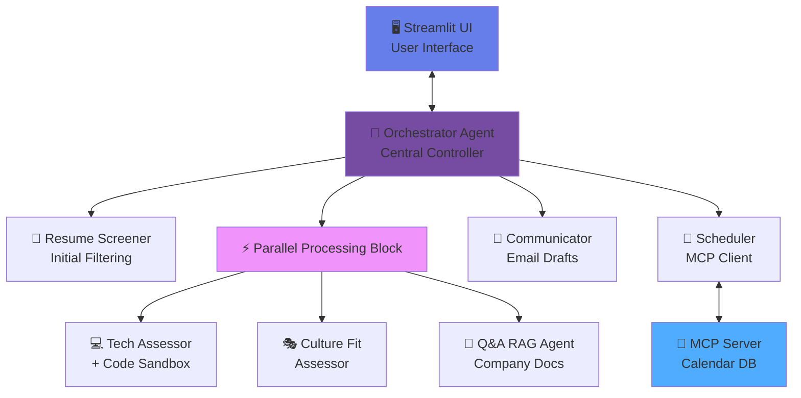

# **Project AGERE (Agentic Recruiter) Google x Kaggle**

AGERE (**AGE**ntic **RE**cruiter) is a **hierarchical, parallel multi-agent system** designed to automate the most time-consuming steps of the recruiting pipeline: resume screening, technical assessment generation, culture-fit analysis, candidate Q&A, interview scheduling, and communication drafting. A **Human-in-the-Loop** layer ensures recruiters retain full control over sensitive actions.

## 🏆 Capstone Submission: Enterprise Agents Track

> **Reducing Time-to-Hire by 40% via Multi-Agent Orchestration & Human-in-the-Loop Governance.**

## 📋 Table of Contents

* [The Problem](#-the-problem)
* [The Solution](#-the-solution)
* [Key Features](#-key-features-course-concepts-applied)
* [Architecture](#️-architecture)
* [Project Structure](#-project-structure)
* [Prerequisites](#-prerequisites)
* [Installation & Setup](#-installation--setup)
* [Configuration](#️-configuration)
* [How to Run](#-how-to-run)
* [Usage Guide](#-usage-guide)
* [Demo & Screenshots](#-demo--screenshots)
* [Technology Stack](#-technology-stack)
* [The Team](#-the-team)
* [License](#-license)
* [Contributing](#-contributing)
* [Support](#-support-the-project)

---

## 🚨 The Problem

Recruiting is broken. Talent Acquisition teams spend **70% of their time** on low-value administrative tasks: parsing resumes, scheduling interviews across time zones, and basic candidate screening. This friction causes a poor candidate experience and risks losing top-tier talent.

## 💡 The Solution

**AGERE** is a **production-grade multi-agent recruiting coordinator**. It autonomously screens resumes, validates technical skills through sandboxed code execution, evaluates culture fit, answers candidate questions, and schedules interviews via live calendar data. **Human-in-the-Loop (HITL)** governance ensures no action is finalized without recruiter approval.

## ⚡ Key Features (Course Concepts Applied)

### 1. 🤖 Hierarchical & Parallel Multi-Agent System

* Hub-and-Spoke architecture with a central `Orchestrator` delegating tasks to specialized agents.
* **Parallel Processing:** `TechAssessor`, `CultureFit`, and `QnAAgent` analyze candidates simultaneously.

### 2. 🛠️ Model Context Protocol (MCP)

* **Real MCP Server** manages calendar availability.
* Scheduler interacts with SQLite-based MCP via compliant client.

### 3. 💻 Code Execution Sandbox

* Tailored coding challenges are generated and validated in a sandbox to ensure solvability before candidate submission.

### 4. 🧠 Semantic Memory & RAG

* **Long-Term Memory:** Tracks candidate interactions for recurring applicants.
* **Company RAG:** Answers candidate queries using grounded documentation.

### 5. 🛑 Human-in-the-Loop (HITL)

* System pauses before sensitive actions (emails). Streamlit UI allows recruiters to edit or approve.

### 6. 👁️ Observability

* Logs agent reasoning, tool inputs/outputs, and state transitions to `app.log` for debugging and compliance.

## 🏗️ Architecture



**Component Responsibilities:**

| Component            | Purpose                               | Key Technologies                   |
| -------------------- | ------------------------------------- | ---------------------------------- |
| **Orchestrator**     | Central hub coordinating agents       | LangChain, Custom routing logic    |
| **Resume Screener**  | Parse and extract CV data             | PyPDF2, spaCy, NLP models          |
| **Tech Assessor**    | Generate & validate coding challenges | Sandbox, LLM                       |
| **Culture Assessor** | Evaluate culture fit                  | RAG, Semantic analysis             |
| **Q&A RAG Agent**    | Answer candidate questions            | Vector DB, Company docs            |
| **Scheduler**        | Manage interview scheduling           | MCP Client, Calendar integration   |
| **Communicator**     | Draft & send emails with HITL         | Email templates, Approval workflow |
| **MCP Server**       | Calendar data management              | SQLite, MCP Protocol               |

## 📁 Project Structure

```
AGERE/
├── main.py                      # Streamlit UI entry
├── requirements.txt
├── .env
├── env.example
├── README.md
├── LICENSE
├── __init__.py
│
├── src/
│   ├── agents/
│   │   ├── __init__.py
│   │   └── agents.py
│   └── tools/
│       ├── __init__.py
│       ├── tools.py
│       └── mcp_client.py
│
├── mcp_server/
│   ├── calendar_server.py
│   └── calendar.db
│
├── test_debug_notebooks/
│   ├── main.ipynb
│   ├── test_debug_agents.ipynb
│   └── test_debug_tools.ipynb
│
├── md_files/
│   └── ...                     # Documentation
│
├── dummy_files_for_testing/
│   └── ...                     # Sample CVs
│
└── temp_uploads/
    └── *.pdf                    # Runtime uploads
```

## 📋 Prerequisites

* Python 3.10+ (Recommended 3.11 or 3.13)
* pip, Git, SQLite
* OS: macOS, Linux, Windows
* RAM: 8GB+ (16GB recommended)
* Disk: 2GB+ free

### API Keys

* OpenAI GPT / Anthropic Claude / Google AI
* Kaggle API (optional)

## 🔧 Installation & Setup

```bash
git clone https://github.com/[your-team-repo]/AGERE.git
cd AGERE
python -m venv .venv
source .venv/bin/activate  # macOS/Linux
.venv\Scripts\activate     # Windows
pip install -r requirements.txt
python -m spacy download en_core_web_sm
cp env.example .env
```

## ⚙️ Configuration

Edit `.env` with API keys:

```
OPENAI_API_KEY=sk-xxxx
ANTHROPIC_API_KEY=sk-xxxx
GOOGLE_API_KEY=xxxx
KAGGLE_USERNAME=xxx
KAGGLE_KEY=xxx
DEBUG_MODE=False
LOG_LEVEL=INFO
```

## 🚀 How to Run

1. Start MCP Server:

```bash
python mcp_server/calendar_server.py
```

2. Launch Streamlit UI:

```bash
streamlit run main.py
```

3. For development, open Jupyter notebooks in `test_debug_notebooks/`.

## 📖 Usage Guide

1. Upload candidate resume
2. Click **"Analyze CV"**
3. Review results & AI-generated insights
4. Approve/edit actions at HITL checkpoints
5. Schedule interviews via MCP integration

## 🔧 Technology Stack

| Category       | Technologies                            |
| -------------- | --------------------------------------- |
| Frontend       | Streamlit                               |
| Backend        | Python 3.13                             |
| AI/LLM         | OpenAI GPT, Anthropic Claude, LangChain |
| NLP            | spaCy, NLTK                             |
| PDF            | PyPDF2, pdfplumber                      |
| Vector Store   | FAISS / ChromaDB                        |
| Database       | SQLite (MCP Calendar)                   |
| Code Execution | Custom Sandbox                          |
| Logging        | Python logging                          |

## 👥 The Team

| Name              | GitHub                                       | Kaggle                                                    | LinkedIn                                                             |
| ----------------- | -------------------------------------------- | --------------------------------------------------------- | -------------------------------------------------------------------- |
| Pietro D'Agostino | [@pitdagosti](https://github.com/pitdagosti) | [pietrodagostino](https://www.kaggle.com/pietrodagostino) | [LinkedIn](https://www.linkedin.com/in/pietro-d-agostino-phd/)       |
| Abdul Basit Memon | [@abm1119](https://github.com/abm1119)       | [abdulbasit1119](https://www.kaggle.com/abdulbasit1119)   | [LinkedIn](https://www.linkedin.com/in/abdul-basit-memon-614961166/) |
| Amos Bocelli      | [@Luminare7](https://github.com/Luminare7)   | [amosboc](https://www.kaggle.com/amosboc)                 | [LinkedIn](https://www.linkedin.com/in/amos-bocelli-bab86411a/)      |
| Asterios Terzis   | [@agterzis](https://github.com/agterzis)     | [asteriosterzis](https://www.kaggle.com/asteriosterzis)   | [LinkedIn](https://www.linkedin.com/in/asterios-terzis-364862277/)   |

## 📜 License

**CC BY-SA 4.0** for code and documentation.

More info: [https://creativecommons.org/licenses/by-sa/4.0/](https://creativecommons.org/licenses/by-sa/4.0/)

## 🤝 Contributing

1. Fork repository
2. Create feature branch
3. Commit changes
4. Push branch
5. Open Pull Request

Follow code style, write tests, update docs, and discuss major changes first.

## ⭐ Support

* Star the repository
* Share with your network
* Report bugs / suggest features

## 📞 Contact & Links

* Hackathon: [Agents Intensive Capstone Project](https://www.kaggle.com/competitions/agents-intensive-capstone-project/team)
* Issues / Team Discussion: GitHub or Kaggle team page

---

<div align="center">

**Built with ❤️ for the Kaggle x Google Agents Intensive Hackathon**

*AGERE - Where Human Intelligence Meets Artificial Intelligence*

</div>