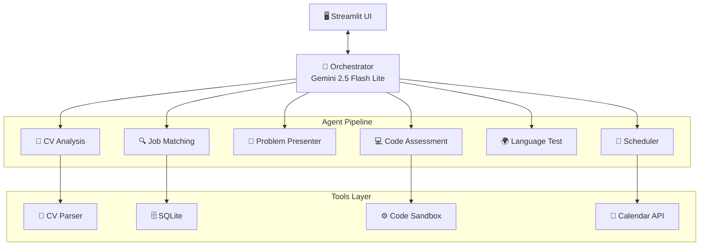

# **PROJECT AGERE - AI-Powered Interview Readiness Coach**

> 🏆 **Kaggle x Google Agents Intensive Capstone Project**
> *Empowering job candidates to ace once-in-a-lifetime opportunities with confidence*

[](https://python.org)
[](https://streamlit.io)
[](https://github.com/google/agent-development-kit)
[](https://creativecommons.org/licenses/by-sa/4.0/)

---

## 📋 Table of Contents

* [Overview](#-overview)
* [Course Concepts Applied](#-course-concepts-applied)
* [Quick Start](#-quick-start)
* [Architecture](#️-architecture)
* [Features & Demo](#-features--demo)
* [Technology Stack](#-technology-stack)
* [The Team](#-the-team)
* [Documentation](#-documentation)

---

## 🎯 Overview

**AGERE** (Agentic Readiness) is an **AI-powered career coach** that helps job candidates validate their skills, match with opportunities, and prepare for interviews with confidence. Built with Google's Agent Development Kit (ADK) and Gemini 2.5 models, AGERE transforms the job search from hope into certainty.

### The Problem

Job seekers face critical challenges:
- **Self-Doubt:** "Am I really qualified for this role?"
- **Skill Uncertainty:** No objective way to validate claimed skills
- **Interview Anxiety:** Showing up unprepared to critical opportunities
- **Missed Connections:** Not knowing who to reach at target companies

### The Solution

AGERE provides:
1. **CV Analysis** → Deep understanding of your qualifications
2. **Smart Job Matching** → Roles where you'll actually excel
3. **Skills Assessment** → Objective validation through:
   - Secure coding challenges in sandboxed environment
   - Language proficiency tests
4. **Google Calendar Integration** → Schedule interviews when YOU'RE ready
5. **Confident Preparation** → Walk in KNOWING you're qualified

---

## 🎓 Course Concepts Applied

### 1. 🤖 Multi-Agent Hierarchical System

**Hub-and-Spoke Architecture with Specialized Agents:**

```
Orchestrator (LlmAgent) → Sequential workflow coordinator
├── CV Analysis Agent → Resume parsing & skill extraction
├── Job Listing Agent → SQLite-based job matching
├── Problem Presenter Tool → Pre-programmed coding challenges
├── Code Assessment Agent → Sandbox-based code evaluation
├── Language Assessment Agent → Multilingual proficiency testing
└── Scheduler Agent → Google Calendar integration
```

**Code:** [`src/agents/agents.py`](src/agents/agents.py)

---

### 2. 🛠️ Custom Tools with Security & Context

**CV Processing:** `read_cv()`, `list_available_cvs()`, `compare_candidates()`
**Code Evaluation:** Sandboxed execution with ToolContext for reliable output validation
**Calendar API:** OAuth2-secured interview scheduling
**Job Database:** SQLite queries with skill matching

**Security Features:**
- 128MB memory limit, 5-second timeout
- Process isolation via multiprocessing
- Forbidden keywords (imports, file I/O, network)
- Platform-specific optimization (macOS/Linux/Windows)

**Code:** [`src/tools/tools.py`](src/tools/tools.py), [`src/tools/code_sandbox.py`](src/tools/code_sandbox.py)

### 3. 🔌 Google Calendar Integration (MCP Concept)

**OAuth2-secured scheduling** with direct Calendar API integration for reliability.

**Code:** [`src/tools/tools.py`](src/tools/tools.py)

---

### 4. 💾 State Management

**Streamlit Session State:** Multi-turn conversation memory with persistent CV analysis and chat history.

**Code:** [`main.py`](main.py)

---

### 5. 🧠 ToolContext Engineering

**Critical for Code Assessment Reliability:**

```python
# Phase 1: Store expected output
context.set("expected_output", "600\n3600")
context.set("problem_generated", True)

# Phase 2: Retrieve & validate
stored = context.get("expected_output")
return "pass" if actual == stored else "not pass"
```

**Why This Matters:** Stateless LLM agents can't reliably remember exact outputs. ToolContext provides deterministic storage across agent turns, ensuring 100% evaluation accuracy.

**Code:** [`src/tools/tools.py`](src/tools/tools.py)

---

### 6. 👁️ Observability

**JSON Event Logging:** Every agent call, tool execution, and user interaction logged with timestamps for debugging and performance analysis.

**Code:** [`main.py`](main.py)

---

### 7. 🔒 Secure Code Execution

**Sandboxed Python runner** with process isolation, memory limits (128MB), timeout (5s), and forbidden keyword filtering. Platform-optimized for macOS/Linux/Windows.

**Code:** [`src/tools/code_sandbox.py`](src/tools/code_sandbox.py)

---

## 🚀 Quick Start

### Prerequisites

- Python 3.10+ 
- Google AI API Key ([Get here](https://aistudio.google.com/apikey))

### Installation (5 minutes)

```bash
# 1. Clone repository
git clone https://github.com/[your-team-repo]/capstone-project-google-kaggle.git
cd capstone-project-google-kaggle

# 2. Create virtual environment
python -m venv .venv
source .venv/bin/activate  # macOS/Linux
# OR
.venv\Scripts\activate     # Windows

# 3. Install dependencies
pip install --upgrade pip
pip install -r requirements.txt

# 4. Configure environment
cp env.example .env
# Edit .env and add your GOOGLE_API_KEY

# 5. Run application
streamlit run main.py
```

The app opens at `http://localhost:8501` 🎉

### Optional: Google Calendar Setup

For interview scheduling features:

```bash
# Add to .env:
GOOGLE_CLIENT_ID=your_client_id
GOOGLE_CLIENT_SECRET=your_client_secret
GOOGLE_REFRESH_TOKEN=your_refresh_token
CALENDAR_ID=your_email@gmail.com
```

See [`md_files/API_KEY_SETUP.md`](md_files/API_KEY_SETUP.md) for detailed instructions.

---

## 🏗️ Architecture



### Workflow

1. **Upload CV** → Streamlit saves to `temp_uploads/`
2. **Analysis** → Extract skills, experience, languages
3. **Job Matching** → SQLite query for relevant positions
4. **Code Challenge** → Pre-programmed problem from template library
5. **Code Evaluation** → Sandbox execution with ToolContext validation
6. **Language Test** → Multilingual proficiency assessment (if applicable)
7. **Scheduling** → Google Calendar integration

---

## ✨ Features & Demo

### Complete Journey

```
📤 Upload CV (PDF/TXT)
    ↓
🔍 AI Analysis → Skills, languages, experience extraction
    ↓
🎯 Job Matching → SQLite database with relevant positions
    ↓
💻 Code Assessment
    ├─ Pre-programmed problem (Backend/ML/Full-Stack)
    ├─ Secure sandbox execution (128MB limit, 5s timeout)
    └─ ToolContext validation → ✅ PASS or ❌ FAIL
    ↓
🌍 Language Test (if multilingual)
    ├─ Generate proficiency test (B1-C2 levels)
    └─ Evaluate response → ✅ proficiency_confirmed
    ↓
📅 Interview Scheduling → Google Calendar integration
```

### Sample Interaction

**User:** "I'm not sure if I'm qualified for senior roles..."

**AGERE:** 
```
✅ Advanced Python (5 years)
✅ Led team of 5 engineers  
✅ Reduced latency by 40%
→ You ARE qualified for senior positions!
```

**Code Assessment:**
```python
Problem: User Data Aggregation (Backend role)
Solution: def sum_even_user_values(users): ...
Result: ✅ PASS - All test cases passed!
```

**Language Test (German C2):**
```
Prompt: "Beschreiben Sie eine komplexe Herausforderung..."
Response: "In einem Projekt führte steigender Datenverkehr..."
Result: ✅ proficiency_confirmed
```

**Outcome:** Interview scheduled via Google Calendar!

---

## 🔧 Technology Stack

| Category | Tools | Purpose |
|----------|-------|---------|
| **AI** | Google ADK 0.1.0+, Gemini 2.5 Flash Lite | Agent orchestration & LLM |
| **Frontend** | Streamlit 1.39+ | Interactive UI with session state |
| **Backend** | Python 3.10+ | Application logic |
| **Processing** | pdfplumber, PyPDF2 | CV parsing |
| **Security** | multiprocessing, resource | Code sandbox |
| **Integration** | Google Calendar API v3, OAuth2 | Interview scheduling |
| **Database** | SQLite | Job listings |
| **Logging** | JSON | Event tracking |

### Key Dependencies

```python
streamlit>=1.39.0
google-adk>=0.1.0
pdfplumber>=0.11.0
google-auth>=2.0.0
google-api-python-client
python-dotenv>=1.0.0
```

---

## 📁 Project Structure

```
capstone-project-google-kaggle/
├── main.py                    # Streamlit entry point
├── requirements.txt           # Dependencies
├── .env                       # Environment config
│
├── src/
│   ├── agents/
│   │   └── agents.py          # All agent definitions
│   ├── tools/
│   │   ├── tools.py           # Custom ADK tools
│   │   └── code_sandbox.py    # Secure code execution
│   └── styles/
│       └── custom.css         # UI styling
│
├── jobs/
│   ├── jobs.db                # SQLite job database
│   └── jobs_db.py             # Database management
│
├── log_files/
│   └── runner_events.log      # JSON event logging
│
├── dummy_files_for_testing/
│   ├── cv_john_doe.pdf        # Test CV samples
│   └── cv_maria_santos.pdf
│
└── temp_uploads/              # User CV uploads
```

---

## 🚀 Status

✅ **All core features working**
- CV Analysis with skill extraction
- Job matching via SQLite
- Secure code assessment with pre-programmed problems
- Language proficiency testing (multilingual support)
- ToolContext-based output validation
- Comprehensive logging & observability

⚠️ **Calendar API** requires OAuth setup (optional feature)

---

## 👥 The Team

Built for the **Kaggle x Google Agents Intensive Hackathon** by:

| Name | GitHub | Kaggle | LinkedIn |
|------|--------|--------|----------|
| **Pietro D'Agostino** | [@pitdagosti](https://github.com/pitdagosti) | [pietrodagostino](https://www.kaggle.com/pietrodagostino) | [LinkedIn](https://www.linkedin.com/in/pietro-d-agostino-phd/) |
| **Abdul Basit Memon** | [@abm1119](https://github.com/abm1119) | [abdulbasit1119](https://www.kaggle.com/abdulbasit1119) | [LinkedIn](https://www.linkedin.com/in/abdul-basit-memon-614961166/) |
| **Amos Bocelli** | [@Luminare7](https://github.com/Luminare7) | [amosboc](https://www.kaggle.com/amosboc) | [LinkedIn](https://www.linkedin.com/in/amos-bocelli-bab86411a/) |
| **Asterios Terzis** | [@agterzis](https://github.com/agterzis) | [asteriosterzis](https://www.kaggle.com/asteriosterzis) | [LinkedIn](https://www.linkedin.com/in/asterios-terzis-364862277/) |

---

## 📚 Documentation

### Quick Links

- **Setup Guide:** [`md_files/QUICK_START.md`](md_files/QUICK_START.md)
- **Architecture Deep Dive:** [`md_files/ARCHITECTURE.md`](md_files/ARCHITECTURE.md)
- **API Key Configuration:** [`md_files/API_KEY_SETUP.md`](md_files/API_KEY_SETUP.md)
- **Troubleshooting:** [`md_files/TROUBLESHOOTING_API_KEY.md`](md_files/TROUBLESHOOTING_API_KEY.md)

### Additional Resources

- [Google ADK Documentation](https://github.com/google/agent-development-kit)
- [Streamlit Docs](https://docs.streamlit.io)
- [Google Calendar API](https://developers.google.com/calendar)
- [Kaggle Competition](https://www.kaggle.com/competitions/agents-intensive-capstone-project)

---

## 📜 License

**CC BY-SA 4.0** - Creative Commons Attribution-ShareAlike 4.0 International

[](https://creativecommons.org/licenses/by-sa/4.0/)

---

## 🤝 Contributing

**Priority Areas:**
- [ ] Vector database integration (FAISS/ChromaDB)
- [ ] Agent evaluation framework
- [ ] Docker containerization
- [ ] Comprehensive test suite

---

## ⭐ Support

- ⭐ **Star on GitHub**
- 🐦 **Share on social media**
- 🐛 **Report bugs or suggest features**

---

<div align="center">

## 🏆 Kaggle x Google Agents Intensive Capstone Project

**PROJECT AGERE - Your AI Career Coach**

*Empowering job candidates to seize once-in-a-lifetime opportunities with absolute confidence*

---

**⚡ Every Interview is Once-in-a-Lifetime - Be Ready**  
**🤖 Powered by Google Gemini & ADK**  
**👥 Built by Developers Who Care**

Made with ❤️ by [Pietro D'Agostino](https://github.com/pitdagosti), [Abdul Basit Memon](https://github.com/abm1119), [Amos Bocelli](https://github.com/Luminare7), and [Asterios Terzis](https://github.com/agterzis)

*Because we believe everyone deserves to walk into their dream interview with confidence, not just hope.*

© 2025 PROJECT AGERE Team • Licensed under CC BY-SA 4.0

[📖 Documentation](./md_files/) • [🐛 Report Bug](../../issues) • [💡 Request Feature](../../issues)

</div>
