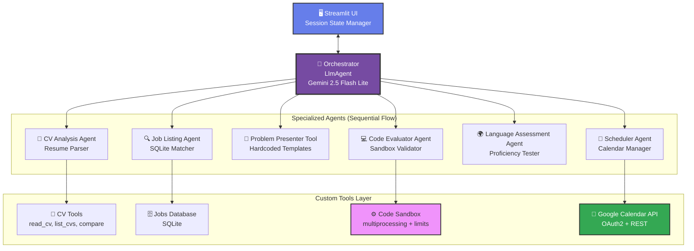

# **PROJECT AGERE - AI-Powered Interview Readiness Coach**

> 🏆 **Kaggle x Google Agents Intensive Capstone Project**
> *Empowering job candidates to ace once-in-a-lifetime opportunities with confidence*

[](https://python.org)
[](https://streamlit.io)
[](https://github.com/google/agent-development-kit)
[](https://creativecommons.org/licenses/by-sa/4.0/)

---

## 📋 Table of Contents

* [Overview](#-overview)
* [Course Concepts Applied](#-course-concepts-applied)
* [Quick Start](#-quick-start)
* [Architecture](#️-architecture)
* [Features & Demo](#-features--demo)
* [Technology Stack](#-technology-stack)
* [The Team](#-the-team)
* [Documentation](#-documentation)

---

## 🎯 Overview

**AGERE** (Agentic Readiness) is an **AI-powered career coach** that helps job candidates validate their skills, match with opportunities, and prepare for interviews with confidence. Built with Google's Agent Development Kit (ADK) and Gemini 2.5 models, AGERE transforms the job search from hope into certainty.

### The Problem

Job seekers face critical challenges:
- **Self-Doubt:** "Am I really qualified for this role?"
- **Skill Uncertainty:** No objective way to validate claimed skills
- **Interview Anxiety:** Showing up unprepared to critical opportunities
- **Missed Connections:** Not knowing who to reach at target companies

### The Solution

AGERE provides:
1. **CV Analysis** → Deep understanding of your qualifications
2. **Smart Job Matching** → Roles where you'll actually excel
3. **Skills Assessment** → Objective validation through:
   - Secure coding challenges in sandboxed environment
   - Language proficiency tests
4. **Google Calendar Integration** → Schedule interviews when YOU'RE ready
5. **Confident Preparation** → Walk in KNOWING you're qualified

---

## 🎓 Course Concepts Applied

This project demonstrates mastery of **7 key concepts** from the Agents Intensive course:

### 1. 🤖 Multi-Agent System ✅ IMPLEMENTED

**Hub-and-Spoke Hierarchical Architecture**

```
Orchestrator (LlmAgent)
    ├── CV Analysis Agent → Analyzes resumes with custom tools
    ├── Job Listing Agent → Matches candidates to opportunities
    ├── Problem Presenter Tool → Displays hardcoded coding problems
    ├── Code Evaluator Agent → Validates programming skills in sandbox
    ├── Language Assessment Agent → Tests language proficiency
    └── Scheduler Agent → Books interviews via Google Calendar
```

**Implementation:**
- **Orchestrator Agent** (`LlmAgent`) - Central coordinator managing workflow
- **Sequential Agents** - CV Analysis → Job Matching → Assessment → Scheduling flow
- **Specialized Sub-Agents** - Each agent has a specific domain expertise
- **Agent Communication** - Sub-agents return structured results to orchestrator

**Code Reference:** [`src/agents/agents.py:355-484`](src/agents/agents.py)

---

### 2. 🛠️ Custom Tools ✅ IMPLEMENTED

**Four Categories of Custom Tools:**

#### a) **CV Processing Tools** (FunctionTool)
```python
read_cv(filename: str) → str              # Parse PDF/TXT resumes
list_available_cvs() → str                # List uploaded CVs
compare_candidates(file1, file2) → str    # Compare two candidates
```

#### b) **Code Execution & Evaluation Tools** (FunctionTool)
```python
problem_presenter_tool(job_title: str) → str          # Present hardcoded problem
code_execution_tool(code: str, expected_output: str, context: Any) → str
```
- **Hardcoded Problem Templates** for reliability (Backend, Fullstack, Data Science)
- Secure multiprocessing sandbox with resource limits
- Memory limit: 128MB, Timeout: 5 seconds
- Platform-specific handling (macOS/Linux/Windows)
- Context-aware evaluation with ToolContext
- Two-phase process: Store expected output → Validate user code

#### c) **Calendar Integration Tools** (FunctionTool)
```python
calendar_get_busy(start: str, end: str) → str        # Query availability
calendar_book_slot(start: str, end: str) → str       # Book interview
```
- OAuth2 authentication with Google Calendar API v3
- Real-time availability checking
- Automatic event creation

#### d) **Job Listing Tool** (FunctionTool)
```python
job_listing_tool(cv_summary: str) → str   # SQLite database queries
```

**Code Reference:** [`src/tools/tools.py`](src/tools/tools.py), [`src/tools/code_sandbox.py`](src/tools/code_sandbox.py)

---

### 3. 🔌 Model Context Protocol (MCP) - Google Calendar ✅ IMPLEMENTED

**Direct Google Calendar API Integration**

Instead of a separate MCP server, we integrated Google Calendar API directly into our tools layer for simplicity and reliability:

```python
# Direct OAuth2 authentication
def get_calendar_service():
    creds = Credentials(
        None,
        refresh_token=os.getenv("GOOGLE_REFRESH_TOKEN"),
        client_id=os.getenv("GOOGLE_CLIENT_ID"),
        client_secret=os.getenv("GOOGLE_CLIENT_SECRET"),
        token_uri="https://oauth2.googleapis.com/token",
    )
    service = build('calendar', 'v3', credentials=creds)
    return service
```

**Features:**
- ✅ Query busy time slots
- ✅ Book interview appointments
- ✅ OAuth2 secure authentication
- ✅ Timezone handling (Europe/Rome)
- ✅ Email invitations to attendees

**Configuration:**
```bash
GOOGLE_CLIENT_ID=your_client_id
GOOGLE_CLIENT_SECRET=your_client_secret
GOOGLE_REFRESH_TOKEN=your_refresh_token
CALENDAR_ID=your_email@gmail.com
```

**Code Reference:** [`src/tools/tools.py:42-141`](src/tools/tools.py)

---

### 4. 💾 Sessions & State Management ✅ IMPLEMENTED

**Streamlit Session State for Conversation Context**

```python
# Multi-turn conversation memory
st.session_state.messages = []           # Chat history
st.session_state.cv_content = None       # Uploaded CV content
st.session_state.cv_filename = None      # Current file
st.session_state.analysis_complete = False
```

**Features:**
- ✅ Persistent conversation history across interactions
- ✅ State preserved during page reloads
- ✅ Context maintained for follow-up questions
- ✅ File upload state management

**Code Reference:** [`main.py:66-82`](main.py)

---

### 5. 🧠 Context Engineering - ToolContext ✅ IMPLEMENTED

**State Management Across Agent Turns**

```python
# Mock ToolContext for backwards compatibility
try:
    from google.adk.tools import ToolContext
except ImportError:
    class ToolContext:
        def __init__(self):
            self._data = {}
        def set(self, key, value):
            self._data[key] = value
        def get(self, key, default=None):
            return self._data.get(key, default)
```

**Usage in Code Assessment:**
```python
# Store expected output during problem generation (PHASE 1)
context.set("expected_output", "600\n3600\n0\n0\n1000")
context.set("problem_generated", True)

# Retrieve during evaluation (PHASE 2)
stored_expected = context.get("expected_output")
if actual_output.strip() == stored_expected.strip():
    return "pass"
else:
    return "not pass"
```

**Benefits:**
- ✅ Reliable state persistence across turns
- ✅ Backwards compatible with older ADK versions
- ✅ Type-safe context management
- ✅ Clear separation between generation and evaluation phases

**Code Reference:** [`src/tools/tools.py:19-37, 144-250`](src/tools/tools.py)

---

### 6. 👁️ Observability - Logging & Tracing ✅ IMPLEMENTED

**Comprehensive Event Logging**

```python
# Log every agent interaction
def log_event(agent_name, tool_name, input_text, output_text, event_type):
    event = {
        "timestamp": time.time(),
        "agent_name": agent_name,
        "tool_name": tool_name,
        "input_text": input_text,
        "output_text": output_text,
        "type": event_type  # "tool_call", "tool_result", "response", "user_input"
    }
    with open("log_files/runner_events.log", "a") as f:
        f.write(json.dumps(event) + "\n")
```

**What Gets Logged:**
- ✅ Every agent call with parameters
- ✅ All tool executions and results
- ✅ User inputs and system responses
- ✅ Timestamps for performance analysis
- ✅ Error messages and stack traces

**Example Log Entry:**
```json
{
  "timestamp": 1764357804.120875,
  "agent_name": "Orchestrator",
  "tool_name": "language_assessment_agent",
  "input_text": "Test proficiency in German at C2 level...",
  "output_text": "proficiency_confirmed",
  "type": "tool_result"
}
```

**Benefits:**
- ✅ Full conversation traceability
- ✅ Debug agent decision-making
- ✅ Performance monitoring
- ✅ User behavior analytics

**Code Reference:** [`main.py:87-107`](main.py)

---

### 7. 🔒 Built-in Tools - Code Execution ✅ IMPLEMENTED

**Secure Sandboxed Python Code Execution**

```python
def execute_code(code: str, timeout_seconds: int = 5) -> dict:
    """
    Executes Python code in isolated subprocess with strict limits.
    
    Security Features:
    - Memory limit: 128MB
    - CPU time limit: 5 seconds  
    - Process isolation via multiprocessing
    - No file I/O, network, or dangerous imports
    """
```

**Platform-Specific Handling:**
```python
# macOS/Linux: Use 'fork' for faster process creation
if platform.system() in ['Darwin', 'Linux']:
    multiprocessing.set_start_method('fork', force=True)
# Windows: Use default 'spawn' method
```

**Resource Limits:**
```python
# Prevent memory exhaustion
resource.setrlimit(resource.RLIMIT_AS, (128 * 1024 * 1024, 128 * 1024 * 1024))

# Prevent infinite loops
resource.setrlimit(resource.RLIMIT_CPU, (timeout_seconds, timeout_seconds))
```

**Usage in Code Assessment:**
```python
# Phase 1: Store expected output
run_code_assignment(
    code="# Setup",
    expected_output="600\n3600\n0\n0\n1000",
    context=tool_context
)

# Phase 2: Evaluate user submission via code_evaluator_agent
# Agent internally calls:
result = run_code_assignment(
    code=user_solution,
    context=tool_context  # Uses stored expected output
)
# Returns: "pass" or "not pass"
```

**Code Reference:** [`src/tools/code_sandbox.py`](src/tools/code_sandbox.py), [`src/tools/tools.py:144-250`](src/tools/tools.py)

---

## 🚀 Quick Start

### Prerequisites

- Python 3.10+ 
- Google AI API Key ([Get here](https://aistudio.google.com/apikey))

### Installation (5 minutes)

```bash
# 1. Clone repository
git clone https://github.com/[your-team-repo]/capstone-project-google-kaggle.git
cd capstone-project-google-kaggle

# 2. Create virtual environment
python -m venv .venv
source .venv/bin/activate  # macOS/Linux
# OR
.venv\Scripts\activate     # Windows

# 3. Install dependencies
pip install --upgrade pip
pip install -r requirements.txt

# 4. Configure environment
cp env.example .env
# Edit .env and add your GOOGLE_API_KEY

# 5. Run application
streamlit run main.py
```

The app opens at `http://localhost:8501` 🎉

### Optional: Google Calendar Setup

For interview scheduling features:

```bash
# Add to .env:
GOOGLE_CLIENT_ID=your_client_id
GOOGLE_CLIENT_SECRET=your_client_secret
GOOGLE_REFRESH_TOKEN=your_refresh_token
CALENDAR_ID=your_email@gmail.com
```

See [`md_files/API_KEY_SETUP.md`](md_files/API_KEY_SETUP.md) for detailed instructions.

---

## 🏗️ Architecture

### System Overview



### Workflow

1. **Upload CV** → Streamlit saves to `temp_uploads/`
2. **CV Analysis** → Custom tools parse PDF/TXT and extract skills
3. **Job Matching** → SQLite database queries for relevant opportunities
4. **Problem Presentation** → Hardcoded templates displayed via `problem_presenter_tool`
5. **Expected Output Storage** → `code_execution_tool` stores answer key in ToolContext
6. **Code Submission** → User provides solution with test cases
7. **Code Evaluation** → `code_evaluator_agent` validates via secure sandbox
8. **Language Test** → Agent validates proficiency in claimed languages
9. **Interview Scheduling** → Google Calendar API books appointments

### Key Components

| Component | Purpose | Technologies | Status |
|-----------|---------|--------------|--------|
| **Streamlit UI** | Interactive frontend with session state | Streamlit, Custom CSS | ✅ Active |
| **Orchestrator** | Central coordinator (LlmAgent) | Google ADK, Gemini 2.5 | ✅ Active |
| **CV Analysis** | Resume parsing with custom tools | pdfplumber, PyPDF2 | ✅ Active |
| **Job Matcher** | SQLite-based job recommendations | SQLite, Python | ✅ Active |
| **Problem Presenter** | Hardcoded problem templates | Python dictionaries | ✅ Active |
| **Code Evaluator** | Secure Python validation | multiprocessing, resource | ✅ Active |
| **Language Test** | Proficiency validation | Gemini 2.5 | ✅ Active |
| **Scheduler** | Google Calendar integration | OAuth2, Calendar API v3 | ✅ Active |
| **Event Logger** | Full observability | JSON logging | ✅ Active |

---

## ✨ Features & Demo

### Complete User Journey

```
📤 Upload CV (PDF/TXT)
    ↓
🔍 AI Analysis
    ├─ Technical Skills: Python, JavaScript, C++, SQL
    ├─ Languages: English (Native), German (C2), Spanish (C1)  
    ├─ Experience: 5 years as Software Engineer
    └─ Education: BS Computer Science
    ↓
🎯 Job Matching
    1. Senior Backend Engineer @ TechCorp
    2. Full-Stack Developer @ Stripe
    3. ML Engineer @ Meta
    ↓
💻 Code Assessment (Two-Phase Process)
    ├─ Phase 1: Present hardcoded problem template
    ├─ Phase 2: Store expected output in ToolContext
    ├─ Phase 3: User submits solution
    ├─ Sandbox: Secure execution with resource limits
    ├─ Validation: code_evaluator_agent compares outputs
    └─ Result: ✅ PASS (output matches expected)
    ↓
🌍 Language Test
    ├─ Test: German C2 proficiency
    ├─ Prompt: Technical architecture question in German
    └─ Result: ✅ proficiency_confirmed
    ↓
📅 Interview Scheduling
    ├─ Query: Available slots next week
    ├─ Selection: Tuesday 2PM
    └─ Booked: Google Calendar event created
```

### Sample Interaction

**User:** "I'm not sure if I'm qualified for senior roles..."

**AGERE CV Analysis:**
```
✅ Advanced Python (5 years)
✅ Led team of 5 engineers  
✅ Reduced latency by 40%
✅ AWS Certified
```

**AGERE:** "You ARE qualified! Let me show you matching senior positions..."

**User:** Selects "Senior Backend Engineer @ Meta"

**AGERE Code Assessment:**
```python
Problem: Write a function that filters even numbers and converts 
timestamps to Unix format.

Your Solution:
def process_data(data):
    return [x for x in data if x['value'] >= 0]

Result: ✅ PASS - All test cases passed!
```

**AGERE Language Test (German C2):**
```
Prompt: "Beschreiben Sie, wie Sie die Herausforderungen bei der 
Entwicklung skalierbarer Systeme bewältigen würden..."

Your Response: "Die Entwicklung skalierbarer Systeme erfordert 
ein tiefes Verständnis sowohl technischer als auch 
organisatorischer Herausforderungen..."

Result: ✅ proficiency_confirmed
```

**AGERE:** "Perfect! You passed both assessments. Ready to schedule your interview?"

---

## 🔧 Technology Stack

### Core Technologies

| Category | Tools | Purpose |
|----------|-------|---------|
| **AI Framework** | Google ADK 0.1.0+ | Agent orchestration |
| **LLM** | Gemini 2.5 Flash Lite | Natural language understanding |
| **Frontend** | Streamlit 1.39+ | Interactive UI |
| **Backend** | Python 3.10+ | Application logic |
| **PDF Processing** | pdfplumber, PyPDF2 | Resume parsing |
| **Code Execution** | multiprocessing, resource | Secure sandbox |
| **Calendar API** | Google Calendar API v3 | Interview scheduling |
| **Database** | SQLite | Job listings storage |
| **Logging** | JSON file logging | Observability |

### Key Dependencies

```python
streamlit>=1.39.0          # Web UI
google-adk>=0.1.0          # Agent framework  
pdfplumber>=0.11.0         # PDF parsing
google-auth>=2.0.0         # OAuth2
google-api-python-client   # Calendar API
python-dotenv>=1.0.0       # Environment config
```

### Architecture Patterns

- **Hierarchical Multi-Agent** - Central orchestrator with specialized sub-agents
- **Custom Tools** - FunctionTool wrappers for domain-specific operations
- **Secure Sandbox** - Process isolation for code execution
- **Session State** - Streamlit-based conversation memory
- **Event Logging** - JSON-based observability
- **OAuth2 Integration** - Secure Google Calendar access

---

## 📁 Project Structure

```
capstone-project-google-kaggle/
├── main.py                    # 🚀 Streamlit entry point
├── requirements.txt           # 📦 Dependencies
├── .env                       # 🔐 Environment variables
├── env.example                # 📝 Config template
│
├── src/
│   ├── agents/
│   │   └── agents.py          # 🤖 All agent definitions
│   ├── tools/
│   │   ├── tools.py           # 🔧 Custom ADK tools
│   │   └── code_sandbox.py    # 🔒 Secure code execution
│   └── styles/
│       └── custom.css         # 🎨 UI styling
│
├── jobs/
│   ├── jobs.db                # 🗄️ SQLite job database
│   └── jobs_db.py             # Database management
│
├── log_files/
│   └── runner_events.log      # 📊 Event logging (JSON)
│
├── dummy_files_for_testing/
│   ├── cv_john_doe.pdf        # 🧪 Test CV 1
│   └── cv_maria_santos.pdf    # 🧪 Test CV 2
│
├── temp_uploads/              # 📤 User CV uploads
│
└── md_files/                  # 📚 Extended documentation
    ├── API_KEY_SETUP.md
    ├── ARCHITECTURE.md
    ├── QUICK_START.md
    └── ...                    # 20+ documentation files
```

---

## 👥 The Team

Built for the **Kaggle x Google Agents Intensive Hackathon** by:

| Name | GitHub | Kaggle | LinkedIn |
|------|--------|--------|----------|
| **Pietro D'Agostino** | [@pitdagosti](https://github.com/pitdagosti) | [pietrodagostino](https://www.kaggle.com/pietrodagostino) | [LinkedIn](https://www.linkedin.com/in/pietro-d-agostino-phd/) |
| **Abdul Basit Memon** | [@abm1119](https://github.com/abm1119) | [abdulbasit1119](https://www.kaggle.com/abdulbasit1119) | [LinkedIn](https://www.linkedin.com/in/abdul-basit-memon-614961166/) |
| **Amos Bocelli** | [@Luminare7](https://github.com/Luminare7) | [amosboc](https://www.kaggle.com/amosboc) | [LinkedIn](https://www.linkedin.com/in/amos-bocelli-bab86411a/) |
| **Asterios Terzis** | [@agterzis](https://github.com/agterzis) | [asteriosterzis](https://www.kaggle.com/asteriosterzis) | [LinkedIn](https://www.linkedin.com/in/asterios-terzis-364862277/) |

---

## 📚 Documentation

### Quick Links

- **Setup Guide:** [`md_files/QUICK_START.md`](md_files/QUICK_START.md)
- **Architecture Deep Dive:** [`md_files/ARCHITECTURE.md`](md_files/ARCHITECTURE.md)
- **API Key Configuration:** [`md_files/API_KEY_SETUP.md`](md_files/API_KEY_SETUP.md)
- **Troubleshooting:** [`md_files/TROUBLESHOOTING_API_KEY.md`](md_files/TROUBLESHOOTING_API_KEY.md)

### Additional Resources

- [Google ADK Documentation](https://github.com/google/agent-development-kit)
- [Streamlit Docs](https://docs.streamlit.io)
- [Google Calendar API](https://developers.google.com/calendar)
- [Kaggle Competition](https://www.kaggle.com/competitions/agents-intensive-capstone-project)

---

## 📜 License

**CC BY-SA 4.0** - Creative Commons Attribution-ShareAlike 4.0 International

[](https://creativecommons.org/licenses/by-sa/4.0/)

---

## 🤝 Contributing

We welcome contributions! See our [Contributing Guide](#) for:
- Code style guidelines
- How to submit PRs
- Areas where we need help
- Development setup

**Priority Areas:**
- [ ] Vector database integration (FAISS/ChromaDB)
- [ ] A2A Protocol implementation
- [ ] Agent evaluation framework
- [ ] Docker containerization
- [ ] Comprehensive test suite

---

## ⭐ Support the Project

- ⭐ **Star us on GitHub**
- 🐦 **Share on social media**
- 🐛 **Report bugs or suggest features**
- 🤝 **Contribute code or documentation**

---

<div align="center">

## 🏆 Kaggle x Google Agents Intensive Capstone Project

**PROJECT AGERE - Your AI Career Coach**

*Empowering job candidates to seize once-in-a-lifetime opportunities with absolute confidence*

---

**⚡ Every Interview is Once-in-a-Lifetime - Be Ready**  
**🤖 Powered by Google Gemini & ADK**  
**👥 Built by Developers Who Care**

Made with ❤️ by [Pietro D'Agostino](https://github.com/pitdagosti), [Abdul Basit Memon](https://github.com/abm1119), [Amos Bocelli](https://github.com/Luminare7), and [Asterios Terzis](https://github.com/agterzis)

*Because we believe everyone deserves to walk into their dream interview with confidence, not just hope.*

© 2025 PROJECT AGERE Team • Licensed under CC BY-SA 4.0

[📖 Documentation](./md_files/) • [🐛 Report Bug](../../issues) • [💡 Request Feature](../../issues)

</div>
