# **PROJECT AGERE (Agentic Interview Readiness) - Google x Kaggle**

AGERE (**AGE**ntic **RE**adiness) is your **AI-powered career coach** built with Google's Agent Development Kit (ADK) and Gemini 2.5 models. It helps job candidates assess their readiness, match their skills to opportunities, validate their expertise through assessments, and confidently reach out to recruiters. Because **every interview is a once-in-a-lifetime opportunity** - AGERE ensures you're ready to seize it.

> 🏆 **Kaggle x Google Agents Intensive Capstone Project**
> 
> **Empowering Job Candidates to Ace Once-in-a-Lifetime Opportunities with Confidence**

## 📋 Table of Contents

* [The Problem](#-the-problem)
* [The Solution](#-the-solution)
* [Key Features](#-key-features-course-concepts-applied)
* [Architecture](#️-architecture)
* [Project Structure](#-project-structure)
* [Prerequisites](#-prerequisites)
* [Installation & Setup](#-installation--setup)
* [Configuration](#️-configuration)
* [How to Run](#-how-to-run)
* [Usage Guide](#-usage-guide)
* [Implementation Status & Roadmap](#️-implementation-status--roadmap)
* [Demo & Screenshots](#-demo--screenshots)
* [Technology Stack](#-technology-stack)
* [The Team](#-the-team)
* [License](#-license)
* [Contributing](#-contributing)
* [Support the Project](#-support-the-project)
* [Contact & Links](#-contact--links)
* [Troubleshooting](#-troubleshooting)
* [Additional Resources](#-additional-resources)

---

## 🚨 The Problem

Job seekers face critical challenges when pursuing their dream careers:

* **Self-Doubt:** "Is my CV actually good enough for this role?"
* **Skill Uncertainty:** "Do I really have the skills they're looking for, or am I overselling myself?"
* **Missed Opportunities:** Applying to jobs you're not ready for wastes everyone's time
* **Interview Anxiety:** Showing up unprepared to a once-in-a-lifetime opportunity
* **No Validation:** No way to objectively test if your claimed skills match job requirements
* **Cold Outreach:** Not knowing how to reach the right person at the company
* **Wasted Chances:** Every interview counts - there are no second chances

**The Result:** Talented candidates miss opportunities because they lack confidence, preparation, or the right connections. You might have the skills, but without validation and preparation, you'll never know if you can ace the interview.

## 💡 The Solution

**AGERE** is your **AI-powered interview preparation coach** built on Google's Agent Development Kit (ADK). It analyzes your CV, matches you to the right opportunities, validates your skills through real assessments, and connects you with the right people - so you can walk into any interview with **absolute confidence**.

### How AGERE Empowers You

🎯 **CV Analysis & Skill Validation:** Deep dive into your resume to extract your true strengths

📋 **Smart Job Matching:** Find roles where you'll actually excel, not just apply blindly

🧪 **Skills Assessment:** Prove to yourself you have what it takes through:
- **Coding Challenges** - Test your programming skills in a safe sandbox
- **Language Proficiency Tests** - Validate your language abilities
- Real-world scenarios matching job requirements

🔍 **Recruiter Finder:** Get LinkedIn profiles of actual recruiters at target companies

✉️ **Outreach Assistance:** Draft professional messages to reach out with confidence

📅 **Interview Scheduling:** Book appointments directly via Google Calendar integration

### Your Journey with AGERE

1. **Upload Your CV** → We analyze your experience, skills, and qualifications
2. **Discover Opportunities** → See jobs you're genuinely qualified for
3. **Test Yourself** → Take assessments to validate your skills match the role
4. **Get Connected** → Find the right recruiter and craft your message
5. **Book Your Interview** → Schedule when you're truly ready

### Why This Matters

Every interview is a **once-in-a-lifetime opportunity**. You don't get second chances to make a first impression. AGERE ensures that when you walk through that door (virtual or physical), you're not hoping you're ready - **you KNOW you're ready**.

### Key Benefits

- 💪 **Confidence** - Walk in knowing your skills match the job
- 🎯 **Precision** - Only apply to roles you're actually ready for
- 📚 **Preparation** - Practice with real assessments before the interview
- 🔗 **Connections** - Reach the right people at the right companies
- ⏰ **Timing** - Schedule when YOU'RE ready, not when they call
- 🚀 **Success** - Maximize your chance of landing that dream job

## ⚡ Key Features (Course Concepts Applied)

### 1. 🤖 Hierarchical Multi-Agent Career Coach ✅ IMPLEMENTED

* **Hub-and-Spoke Architecture:** Central `Orchestrator` guides your journey through specialized agent assistants
* **Your Personal Agent Team:** 
  - **Orchestrator Agent** - Your career journey coordinator and guide
  - **CV Analysis Agent** - Understands your skills and qualifications deeply
  - **Job Listing Agent** - Finds opportunities perfect for YOUR profile
  - **Recruiter Finder Agent** - Connects you to real decision-makers
* **Google ADK Framework:** Built with Google's Agent Development Kit and Gemini 2.5 Flash Lite
* **Conversational Flow:** Natural dialogue helps you understand your readiness

### 2. 🛠️ Model Context Protocol (MCP) - Schedule When Ready ✅ READY

* **Real MCP Server:** Flask-based REST API manages Google Calendar
* **Calendar Client:** Book interviews when YOU feel confident, not rushed
* **Google Calendar API v3:** OAuth2 secure integration with your calendar
* **Smart Scheduling:**
  - Query available time slots
  - Book interviews without conflicts
  - Automatic timezone handling
  - Email invitations sent to you and recruiter
* **Status:** Infrastructure complete, awaiting Scheduler Agent integration

### 3. 💻 Code Execution Sandbox - Prove Your Skills ✅ IMPLEMENTED

* **Safe Testing Environment:** Practice coding challenges without consequences
* **Security Features:**
  - Isolated environment protects your system
  - Time limits prevent infinite loops
  - Memory limits (128MB) prevent crashes
  - Only safe operations allowed
* **Real Assessment:** Test your programming skills before the actual interview
* **Instant Feedback:** See results immediately to gauge readiness
* **Status:** Ready for Tech Assessor Agent to generate personalized challenges

### 4. 🧠 Semantic Memory & Career Knowledge 🔨 PLANNED

* **Your Career History:** Remember your journey, applications, and growth
* **Job Research:** Answer questions about target companies using their documentation
* **Learn from Experience:** Track what worked in past applications
* **Vector Store:** FAISS/ChromaDB for intelligent search

### 5. 🛑 You're in Control - Always 🔨 PLANNED

* **Your Decision:** System suggests, YOU decide when to reach out
* **Edit Everything:** Modify AI-generated messages before sending
* **No Surprises:** Review every action before it happens
* **Your Pace:** Only move forward when YOU'RE ready

### 6. 👁️ Transparency & Trust ✅ PARTIAL

* **See the Thinking:** ADK's `run_debug()` shows how agents reason about your profile
* **Full History:** Track all conversations and decisions in session state
* **Clear Feedback:** Understand why certain jobs match or don't match
* **Next Steps:** Implement detailed logging for your career journey tracking

### 7. 🎨 Modern, Confidence-Building UI ✅ IMPLEMENTED

* **Clean Interface:** Professional Streamlit design inspires confidence
* **Easy Upload:** Drag-and-drop for PDF and TXT CVs
* **Interactive Coaching:** Modal chat for deep career discussions
* **Real-time Guidance:** Progress indicators and supportive messages
* **Beautiful Design:**
  - Inspiring gradient headers
  - Smooth animations
  - Step-by-step visual guides
  - Chat interface for natural conversation

### 8. 🎯 Skills Validation - Know You're Ready 🔨 COMING SOON

* **Coding Challenges:** Test your technical skills objectively
* **Language Tests:** Validate proficiency claims with real assessments
* **Readiness Score:** Get a confidence metric before applying
* **Gap Analysis:** See what to practice more before the interview
* **Mock Scenarios:** Practice real interview questions for your target role

## 🏗️ Architecture

### Current System Architecture

AGERE implements a **hierarchical multi-agent architecture** powered by Google's Agent Development Kit (ADK) and Google Gemini models. The system features a central Orchestrator agent that coordinates specialized sub-agents to handle different aspects of the recruitment workflow.

```mermaid
graph TB
    UI[🖥️ Streamlit UI<br/>Interactive Frontend]
    ORCH[🎯 Orchestrator Agent<br/>LLM Manager<br/>Gemini 2.5 Flash Lite]
    
    subgraph "Specialized Agents"
        CV[📄 CV Analysis Agent<br/>Resume Parser<br/>Gemini 2.5 Flash Lite]
        JOB[🔍 Job Listing Agent<br/>Google Search<br/>Gemini 2.5 Flash Lite]
        REC[👔 Recruiter Finder Agent<br/>LinkedIn Search<br/>Gemini 2.5 Flash Lite]
    end
    
    subgraph "Custom Tools Layer"
        CVTOOLS[📂 CV Tools<br/>read_cv<br/>list_cvs<br/>compare_candidates]
        GSEARCH[🌐 Google Search Tool<br/>Web Search API]
        SANDBOX[⚙️ Code Sandbox<br/>execute_code<br/>multiprocessing]
        MCPCLIENT[📅 MCP Client<br/>CalendarClient<br/>REST API]
    end
    
    subgraph "External Services"
        MCP[🔌 MCP Calendar Server<br/>Flask REST API<br/>Google Calendar API]
        GCAL[📆 Google Calendar<br/>OAuth2 Integration]
    end
    
    UI <--> ORCH
    ORCH --> CV
    ORCH --> JOB
    ORCH --> REC
    
    CV --> CVTOOLS
    JOB --> GSEARCH
    REC --> GSEARCH
    
    CVTOOLS -.-> SANDBOX
    MCPCLIENT <--> MCP
    MCP <--> GCAL
    
    style UI fill:#667eea,stroke:#333,stroke-width:2px,color:#fff
    style ORCH fill:#764ba2,stroke:#333,stroke-width:3px,color:#fff
    style CV fill:#f093fb,stroke:#333,stroke-width:2px,color:#333
    style JOB fill:#f093fb,stroke:#333,stroke-width:2px,color:#333
    style REC fill:#f093fb,stroke:#333,stroke-width:2px,color:#333
    style MCP fill:#4facfe,stroke:#333,stroke-width:2px,color:#fff
    style GCAL fill:#34a853,stroke:#333,stroke-width:2px,color:#fff
```



### Component Responsibilities

| Component                 | Purpose for Candidates                                    | Technologies                                  | Status      |
| ------------------------- | --------------------------------------------------------- | --------------------------------------------- | ----------- |
| **Streamlit UI**          | Upload CV and interact with your career coach             | Streamlit, Custom CSS, Async/Await            | ✅ Active   |
| **Orchestrator Agent**    | Guides you through the entire preparation journey         | Google ADK, Gemini 2.5 Flash Lite, AgentTool  | ✅ Active   |
| **CV Analysis Agent**     | Deep-dive into your skills, experience, and strengths     | Google ADK, Custom CV Tools, PDF/TXT parsing  | ✅ Active   |
| **Job Listing Agent**     | Find jobs that match YOUR skills and experience           | Google ADK, Google Search Tool                | ✅ Active   |
| **Recruiter Finder**      | Connect you with real recruiters at target companies      | Google ADK, Google Search Tool                | ✅ Active   |
| **CV Tools**              | Read and analyze your resume accurately                   | pdfplumber, PyPDF2, pathlib                   | ✅ Active   |
| **Code Sandbox**          | Safe environment to test your coding skills               | multiprocessing, resource limits, timeout     | ✅ Ready    |
| **MCP Calendar Client**   | Book interview appointments when you're ready             | requests, datetime, JSON                      | ✅ Ready    |
| **MCP Calendar Server**   | Manage interview scheduling with Google Calendar          | Flask, Google Calendar API v3, OAuth2         | ✅ Ready    |
| **Tech Assessor** ⚠️      | Generate coding challenges to validate your skills        | Code Sandbox + LLM                            | 🔨 Planned |
| **Language Test Agent** ⚠️| Test your language proficiency objectively                | NLP, Custom assessment                        | 🔨 Planned |
| **Scheduler Agent** ⚠️    | Schedule interview when YOU'RE confident and ready        | MCP Client, Google Calendar                   | 🔨 Planned |
| **Communicator Agent** ⚠️ | Draft professional outreach messages to recruiters        | Email templates, Message generation           | 🔨 Planned |

### Your Journey Through AGERE

1. **You upload your CV** → Streamlit UI securely saves to `temp_uploads/`
2. **Orchestrator coordinates** → CV Analysis Agent reads and deeply analyzes your resume
3. **Skills extracted** → Custom `read_cv` tool supports both PDF and TXT formats
4. **Insights delivered** → Orchestrator summarizes your strengths and opportunities
5. **Jobs matched** → Job Listing Agent searches for roles that fit YOUR profile
6. **You select a job** → Recruiter Finder Agent locates the right person to contact
7. **Assessments ready** → Tech/Language agents test if you're truly prepared (coming soon)
8. **Interview scheduled** → Book when you're confident and ready (coming soon)

### Tool Architecture

**Custom ADK Tools:**
- `read_cv(filename)` - Reads CV files from temp_uploads or test directories
- `list_available_cvs()` - Lists all available CV files for testing
- `compare_candidates(file1, file2, criteria)` - Compares two CVs

**External Tools:**
- `google_search` - Google Search integration via ADK
- `execute_code` - Sandboxed Python code execution with timeout and memory limits
- `CalendarClient` - REST client for MCP Calendar Server

### Data Flow

```
User → Upload CV → temp_uploads/
                      ↓
              Orchestrator Agent
                      ↓
          ┌───────────┼───────────┐
          ↓           ↓           ↓
    CV Analysis  Job Listing  Recruiter
       Agent        Agent       Finder
          ↓           ↓           ↓
      CV Tools  Google Search  Google Search
          ↓           ↓           ↓
          └───────────┼───────────┘
                      ↓
              Back to User (via Streamlit)
```

## 📁 Project Structure

```
capstone-project-google-kaggle/
├── main.py                    # Streamlit App
├── requirements.txt
├── .env / env.example
├── README.md
│
├── src/
│   ├── agents/
│   │   └── agents.py          # Orchestrator + Specialized Agents
│   ├── tools/
│   │   ├── tools.py           # CV operations
│   │   ├── code_sandbox.py    # Sandboxed execution
│   │ 
│   └── styles/custom.css
│
└── temp_uploads/
```

### File Descriptions

**Core Application Files:**
- `main.py` - Streamlit application with chat UI, async agent runner, file upload handling
- `src/agents/agents.py` - All agent definitions using Google ADK (Orchestrator, CV Analysis, Job Listing, Recruiter Finder)
- `src/tools/tools.py` - Custom ADK tools for CV operations (read, list, compare)
- `src/tools/code_sandbox.py` - Secure Python code execution with timeout, memory limits, and security checks
- `src/tools/mcp_client.py` - REST client for calendar operations (get busy slots, book interviews)

**Infrastructure Files:**
- `mcp_server/calendar_server.py` - Flask REST API server with Google Calendar API integration
- `src/styles/custom.css` - Modern UI styling with gradient headers, hover effects, and chat bubbles

**Configuration Files:**
- `.env` - Contains API keys (GOOGLE_API_KEY, GOOGLE_REFRESH_TOKEN, CALENDAR_ID, etc.)
- `env.example` - Template showing required environment variables
- `requirements.txt` - Python package dependencies (streamlit, google-adk, pdfplumber, etc.)

## 📋 Prerequisites

### System Requirements

* **Python:** 3.10, 3.11, or 3.13 (recommended)
* **Package Manager:** pip 23.0+
* **Version Control:** Git
* **Operating System:** macOS, Linux, or Windows 10+
* **RAM:** 4GB minimum, 8GB+ recommended
* **Disk Space:** 2GB free space
* **Internet:** Required for API calls and Google Search

### API Keys Required

#### Essential (For Core Functionality)

* **Google AI API Key** - Required for all agent operations
  * Get from [Google AI Studio](https://aistudio.google.com/apikey)
  * Free tier available with generous quotas
  * Used by all agents (Orchestrator, CV Analysis, Job Listing, Recruiter Finder)

#### Optional (For Extended Features)

* **Google Calendar API Credentials** - For interview scheduling (MCP Server)
  * OAuth2 Client ID and Secret
  * Refresh Token with calendar scope
  * Calendar ID (your Gmail address)
  * Setup guide: `md_files/API_KEY_SETUP.md`

* **OpenAI API Key** - Alternative LLM provider (not currently used)
* **Anthropic API Key** - Alternative LLM provider (not currently used)
* **Kaggle API** - For competition submission (optional)

### Python Dependencies

Main packages (see `requirements.txt` for complete list):
- `streamlit>=1.39.0` - Web UI
- `google-adk>=0.1.0` - Agent framework
- `pdfplumber>=0.11.0` - PDF processing
- `python-dotenv>=1.0.0` - Environment config
- `flask` - MCP server (optional)
- `langchain>=0.3.0` - Future RAG features
- `spacy>=3.7.0` - NLP processing

### Development Tools (Optional)

- Jupyter Lab/Notebook - For testing notebooks
- VS Code or PyCharm - IDE
- Postman - For testing MCP REST API
- Docker - For containerization (future)

## 🔧 Installation & Setup

### Quick Install (5 minutes)

```bash
# 1. Clone the repository
git clone https://github.com/[your-team-repo]/capstone-project-google-kaggle.git
cd capstone-project-google-kaggle

# 2. Create virtual environment
python -m venv .venv

# 3. Activate virtual environment
source .venv/bin/activate  # macOS/Linux
# OR
.venv\Scripts\activate     # Windows PowerShell

# 4. Install dependencies
pip install --upgrade pip
pip install -r requirements.txt

# 5. Download spaCy language model (for NLP features)
python -m spacy download en_core_web_sm

# 6. Configure environment variables
cp env.example .env
# Edit .env and add your GOOGLE_API_KEY

# 7. Test installation
python -c "import streamlit; import google.adk; print('✅ Installation successful!')"
```

### Detailed Setup Steps

#### Step 1: Clone Repository

```bash
git clone https://github.com/[your-team-repo]/capstone-project-google-kaggle.git
cd capstone-project-google-kaggle
```

#### Step 2: Virtual Environment Setup

**macOS/Linux:**
```bash
python3 -m venv .venv
source .venv/bin/activate
```

**Windows (Command Prompt):**
```cmd
python -m venv .venv
.venv\Scripts\activate.bat
```

**Windows (PowerShell):**
```powershell
python -m venv .venv
.venv\Scripts\Activate.ps1
```

**Verify activation:**
```bash
which python  # macOS/Linux - should show .venv path
where python  # Windows - should show .venv path
```

#### Step 3: Install Dependencies

```bash
# Upgrade pip first
pip install --upgrade pip

# Install all requirements
pip install -r requirements.txt

# Verify installation
pip list | grep streamlit
pip list | grep google-adk
```

#### Step 4: Configure API Keys

```bash
# Copy template
cp env.example .env

# Edit with your preferred editor
nano .env  # or vim, code, notepad, etc.
```

**Minimum required in `.env`:**
```bash
GOOGLE_API_KEY=your_actual_api_key_here
GOOGLE_GENAI_USE_VERTEXAI=FALSE
```

#### Step 5: Verify Setup

```bash
# Test Python imports
python -c "from src.agents import orchestrator; print('✅ Agents loaded')"

# Test Streamlit
streamlit hello  # Opens Streamlit demo

# Test ADK
python -c "from google.adk.agents import Agent; print('✅ ADK working')"
```

### Optional: MCP Calendar Server Setup

Only needed for interview scheduling features:

```bash
# 1. Set up Google Calendar API credentials (see md_files/API_KEY_SETUP.md)

# 2. Add to .env:
GOOGLE_CLIENT_ID=your_client_id
GOOGLE_CLIENT_SECRET=your_client_secret
GOOGLE_REFRESH_TOKEN=your_refresh_token
CALENDAR_ID=your_email@gmail.com

# 3. Test server
cd mcp_server
python calendar_server.py
# Should start on http://127.0.0.1:5000
```

### Troubleshooting Installation

**Issue: "Command 'python' not found"**
```bash
# Try python3 instead
python3 -m venv .venv
```

**Issue: "Permission denied" on macOS/Linux**
```bash
# Use python3 with explicit path
/usr/bin/python3 -m venv .venv
```

**Issue: "Cannot activate virtual environment (Windows)"**
```powershell
# Enable script execution
Set-ExecutionPolicy -ExecutionPolicy RemoteSigned -Scope CurrentUser
```

**Issue: "pip install fails"**
```bash
# Try with --user flag
pip install --user -r requirements.txt
# Or upgrade pip first
python -m pip install --upgrade pip
```

## ⚙️ Configuration

### Required Environment Variables

Create a `.env` file in the project root (use `env.example` as template):

```bash
# Required - Google AI API Key
GOOGLE_API_KEY=your_google_api_key_here
GOOGLE_GENAI_USE_VERTEXAI=FALSE

# Optional - MCP Calendar Server (Google Calendar Integration)
GOOGLE_CLIENT_ID=your_google_oauth_client_id
GOOGLE_CLIENT_SECRET=your_google_oauth_client_secret
GOOGLE_REFRESH_TOKEN=your_google_refresh_token
CALENDAR_ID=your_calendar_id@gmail.com

# Optional - Alternative LLM Providers
OPENAI_API_KEY=sk-xxxx
ANTHROPIC_API_KEY=sk-ant-xxxx

# Optional - Kaggle Integration
KAGGLE_USERNAME=your_username
KAGGLE_KEY=your_api_key

# Optional - Application Settings
DEBUG_MODE=False
LOG_LEVEL=INFO
```

### Getting Google API Key

1. Visit [Google AI Studio](https://aistudio.google.com/apikey)
2. Click "Create API Key"
3. Copy the key to your `.env` file as `GOOGLE_API_KEY`
4. Set `GOOGLE_GENAI_USE_VERTEXAI=FALSE` to use Google AI Studio

### Setting Up Google Calendar (Optional)

For MCP Calendar Server functionality:

1. **Create OAuth2 Credentials:**
   - Go to [Google Cloud Console](https://console.cloud.google.com)
   - Create a new project or select existing
   - Enable Google Calendar API
   - Create OAuth 2.0 credentials (Desktop application type)
   - Download client configuration

2. **Generate Refresh Token:**
   - Use Google OAuth2 Playground or custom script
   - Request scope: `https://www.googleapis.com/auth/calendar`
   - Save refresh token to `.env`

3. **Configure Calendar:**
   - Set `CALENDAR_ID` to your Google Calendar email
   - Ensure calendar sharing permissions are correct

See `md_files/API_KEY_SETUP.md` for detailed instructions.

### File Permissions

Ensure these directories are writable:
- `temp_uploads/` - User CV uploads (auto-created)
- `mcp_server/` - Calendar database (if using MCP server)

## 🚀 How to Run

### Quick Start (Streamlit UI)

**Note:** The MCP Calendar Server is optional for basic CV analysis functionality.

```bash
# 1. Activate your virtual environment
source .venv/bin/activate  # macOS/Linux
.venv\Scripts\activate     # Windows

# 2. Launch Streamlit UI
streamlit run main.py
```

The application will open at `http://localhost:8501`

### Full Setup (with MCP Calendar Server)

**Terminal 1 - MCP Calendar Server:**
```bash
# Start the Flask calendar server
cd mcp_server
python calendar_server.py
```
Server runs at `http://127.0.0.1:5000`

**Terminal 2 - Streamlit UI:**
```bash
# Launch the main application
streamlit run main.py
```

### Testing with Jupyter Notebooks

For development and debugging:

```bash
# Launch Jupyter Lab
jupyter lab

# Open notebooks in test_debug_notebooks/
# - main.ipynb - Main workflow testing
# - test_debug_agents.ipynb - Agent behavior testing
# - test_debug_tools.ipynb - Tool functionality testing
```

### Using the Application

1. **Upload Your CV:** Drag-and-drop or click to upload your PDF/TXT resume
2. **Analyze Your Profile:** Click "🔍 Analyze CV" to see your strengths
3. **Ask Questions:** Use the chat to explore your qualifications deeper
4. **Find Jobs:** Confirm when ready to see roles you're qualified for
5. **Select Target Role:** Pick the job that excites you most
6. **Get Recruiter Info:** Find who to contact at the company
7. **Prepare & Connect:** (Coming Soon) Take assessments and schedule interview
8. **Start Fresh:** Click "🗑️ Clear & Reset" to analyze a different CV

### Test Files Available

The project includes sample CVs for testing:
- `dummy_files_for_testing/cv_john_doe.txt` - Software Engineer profile
- `dummy_files_for_testing/cv_john_doe.pdf` - Same in PDF format
- `dummy_files_for_testing/cv_maria_santos.txt` - Data Scientist profile
- `dummy_files_for_testing/cv_maria_santos.pdf` - Same in PDF format

Upload your own CVs to `temp_uploads/` or use the UI uploader.

## 📖 Usage Guide - Your Path to Interview Success

### Step-by-Step: From CV Upload to Interview Ready

1. **Upload Your CV**
   - Drag and drop your resume (PDF or TXT)
   - AGERE securely analyzes your document

2. **Review Your Profile**
   - See your skills, experience, and education extracted
   - Understand how AI perceives your qualifications
   - Ask follow-up questions about your strengths

3. **Discover Matching Jobs**
   - Get 5 job recommendations that match YOUR profile
   - Not just any jobs - roles you're actually qualified for
   - Request more options if needed

4. **Validate Your Skills (Coming Soon)**
   - Take coding challenges relevant to the job
   - Test language proficiency if required
   - Get objective proof you're ready

5. **Connect with Recruiters**
   - Find the right person at your target company
   - Get their LinkedIn profile
   - Review AI-generated outreach message

6. **Schedule Your Interview (Coming Soon)**
   - Book appointment via Google Calendar
   - Only when YOU feel ready and confident
   - Show up prepared, not just hopeful

## 🗺️ Implementation Status & Roadmap

### ✅ Phase 1: Core Foundation - YOUR Career Coach (COMPLETE)

- [x] Beautiful Streamlit UI for CV upload and coaching
- [x] Google ADK integration with Gemini 2.5 Flash Lite
- [x] Orchestrator Agent guides your journey
- [x] CV Analysis Agent understands your qualifications
- [x] Job Listing Agent finds opportunities for YOU
- [x] Recruiter Finder Agent connects you to real people
- [x] Custom CV tools (read, analyze, compare)
- [x] Code Sandbox ready for skills testing
- [x] MCP Calendar Server for interview scheduling
- [x] CalendarClient REST API integration
- [x] Modern, confidence-inspiring UI design

### 🔨 Phase 2: Skills Validation & Connection (IN PROGRESS)

- [ ] **Tech Assessor Agent** - Test your coding skills with real challenges
- [ ] **Language Test Agent** - Validate your language proficiency claims
- [ ] **Assessment Feedback** - Get detailed results and improvement tips
- [ ] **Scheduler Agent** - Book interviews when you're ready
- [ ] **Communicator Agent** - Draft professional outreach messages
- [ ] **Skill Gap Analysis** - Identify what to learn before applying
- [ ] **Interview Prep Tips** - AI-powered advice for your specific role
- [ ] **Mock Interview** - Practice common questions for your target job
- [ ] **Progress Tracking** - See your readiness score improve over time
- [ ] **Resume Improvement** - Suggestions to strengthen your CV

### 🎯 Phase 3: Complete Career Companion (PLANNED)

- [ ] Multiple CV versions for different job types
- [ ] Track applications and interviews in one place
- [ ] Company culture analysis and fit scoring
- [ ] Salary negotiation preparation
- [ ] Interview question prediction based on role
- [ ] Post-interview follow-up assistance
- [ ] Skills learning path recommendations
- [ ] Network mapping (who you know at target companies)
- [ ] Success analytics (track your improvement)
- [ ] Mobile app for on-the-go preparation

### 📊 What You Can Do Today

**Ready Now:**
- ✅ Upload and analyze your CV
- ✅ Understand your professional strengths
- ✅ Find jobs that match YOUR qualifications
- ✅ Discover recruiters at target companies
- ✅ Ask questions about your career prospects
- ✅ Compare your CV to different roles
- ✅ Get honest feedback on your readiness

**Coming Very Soon:**
- 🔨 Test your technical skills before applying
- 🔨 Validate language abilities objectively
- 🔨 Schedule interviews when YOU'RE confident
- 🔨 Get professional message templates for outreach
- 🔨 See your readiness score for specific jobs

## 🎬 Demo & Screenshots

### Live Demo

Watch AGERE in action:
- **Video Demo:** _(Coming Soon)_
- **Kaggle Submission:** [Agents Intensive Capstone Project](https://www.kaggle.com/competitions/agents-intensive-capstone-project/)

### Key Features Showcase

**1. CV Upload & Analysis**
- Modern drag-and-drop interface
- Support for PDF and TXT formats
- Real-time file validation and preview
- Instant parsing and information extraction

**2. Interactive Agent Workflow**
- Orchestrator coordinates specialized agents
- CV Analysis Agent extracts skills, experience, education
- Job Listing Agent searches for matching opportunities
- Recruiter Finder Agent locates LinkedIn profiles

**3. Chat-Based Interaction**
- Natural language conversation with AI
- Follow-up questions about candidates
- Comparative analysis between CVs
- Context-aware responses using conversation history

**4. Modern UI/UX**
- Gradient headers with glassmorphism effects
- Smooth animations and hover effects
- Responsive design for all screen sizes
- Custom CSS styling throughout

### Example: John's Journey to Confidence

```text
📤 Step 1: John uploads "cv_john_doe.pdf"
   "I'm not sure if I'm ready for senior roles..."
   ↓
🔍 Step 2: AGERE analyzes his qualifications
   CV_analysis_agent extracts his real strengths
   ↓
💪 Step 3: John sees his true capabilities:
   • Skills: Python, JavaScript, Docker, AWS, React
   • Experience: 5 years as Software Engineer at TechCorp
   • Projects: Led team of 5, reduced latency by 40%
   • Education: BS Computer Science, MIT (2018)
   "Wow, I'm more qualified than I thought!"
   ↓
🎯 Step 4: AGERE asks: "Want to see jobs you're ready for?"
   John confirms, nervous but curious
   ↓
📋 Step 5: Job Listing Agent returns 5 matches:
   1. Senior Software Engineer at Meta
   2. Full Stack Developer at Stripe
   3. Cloud Engineer at AWS
   4. Backend Engineer at Netflix
   5. Tech Lead at Airbnb
   ↓
❤️ Step 6: John selects "Meta" - his dream company
   "This is my once-in-a-lifetime shot!"
   ↓
🔗 Step 7: Recruiter Finder finds the right person
   Returns: Sarah Johnson - Technical Recruiter at Meta
   LinkedIn: linkedin.com/in/sarahjohnson-meta
   ↓
📝 Step 8: (Coming Soon) AGERE generates outreach message
   ✅ Step 9: (Coming Soon) John takes coding assessment
   📅 Step 10: (Coming Soon) Schedules interview with confidence
   
✨ Result: John walks into that Meta interview KNOWING he's ready,
   not just hoping. He aces it because he VALIDATED his skills first.
```

### Sample Agent Responses

**CV Analysis Output:**
```markdown
**1. Candidate Information**
- Full name: John Doe
- Email: john.doe@email.com
- Location: San Francisco, CA

**2. Technical Skills**
- Programming: Python, JavaScript, TypeScript, Go
- Frameworks: React, Node.js, Django, Flask
- Cloud: AWS, Docker, Kubernetes
- Databases: PostgreSQL, MongoDB, Redis

**3. Work Experience**
- Current: Senior Software Engineer at TechCorp (2020-Present)
  - Led team of 5 engineers
  - Built microservices architecture
  - Reduced latency by 40%
...
```

### Testing with Sample CVs

The project includes test CVs you can try:
- `cv_john_doe.pdf` - Software Engineer with 5 years experience
- `cv_maria_santos.pdf` - Data Scientist with ML/AI expertise

Both available in `.txt` and `.pdf` formats in `dummy_files_for_testing/`

## 🔧 Technology Stack

| Category           | Technologies                                                                              | Status      |
| ------------------ | ----------------------------------------------------------------------------------------- | ----------- |
| **Frontend**       | Streamlit 1.39+, Custom CSS, HTML5                                                        | ✅ Active   |
| **Backend**        | Python 3.10-3.13                                                                          | ✅ Active   |
| **AI Framework**   | Google Agent Development Kit (ADK) 0.1.0+                                                 | ✅ Active   |
| **LLM Models**     | Google Gemini 2.5 Flash Lite (primary)                                                    | ✅ Active   |
| **Agent Tools**    | google_search, AgentTool, FunctionTool                                                    | ✅ Active   |
| **PDF Processing** | pdfplumber 0.11.0+, PyPDF2 3.0.0+                                                         | ✅ Active   |
| **NLP Libraries**  | spaCy 3.7.0+, NLTK 3.8.0+                                                                 | 📦 Installed|
| **Web Framework**  | Flask (MCP Server)                                                                        | ✅ Active   |
| **Calendar API**   | Google Calendar API v3, OAuth2                                                            | ✅ Active   |
| **Code Sandbox**   | multiprocessing, resource limits, contextlib                                              | ✅ Active   |
| **Vector Store**   | FAISS / ChromaDB                                                                          | 🔨 Planned  |
| **HTTP Client**    | requests, REST API                                                                        | ✅ Active   |
| **Data Processing**| pandas 2.2.0+, numpy 1.26.0+                                                              | 📦 Installed|
| **Async/Await**    | asyncio, event loop management                                                            | ✅ Active   |
| **Environment**    | python-dotenv 1.0.0+                                                                      | ✅ Active   |
| **Logging**        | Python logging, Streamlit status                                                          | 🔨 Partial  |
| **Database**       | SQLite (calendar.db - not yet utilized)                                                   | 🔨 Planned  |

### Key Dependencies

```python
# requirements.txt highlights
streamlit>=1.39.0           # Web UI framework
google-adk>=0.1.0           # Agent Development Kit
pdfplumber>=0.11.0          # PDF text extraction
python-dotenv>=1.0.0        # Environment variables
langchain>=0.3.0            # Future RAG integration
spacy>=3.7.0                # NLP processing
pandas>=2.2.0               # Data manipulation
```

### Architecture Patterns

- **Agent Pattern:** Hierarchical multi-agent with central orchestration
- **Tool Pattern:** Composable functions exposed via ADK FunctionTool
- **MCP Pattern:** REST API server for external service integration
- **Sandbox Pattern:** Process isolation for secure code execution
- **Session State:** Streamlit session management for conversation continuity
- **Async Pattern:** Async/await for non-blocking agent execution

## 👥 The Team

| Name              | GitHub                                       | Kaggle                                                    | LinkedIn                                                             |
| ----------------- | -------------------------------------------- | --------------------------------------------------------- | -------------------------------------------------------------------- |
| Pietro D'Agostino | [@pitdagosti](https://github.com/pitdagosti) | [pietrodagostino](https://www.kaggle.com/pietrodagostino) | [LinkedIn](https://www.linkedin.com/in/pietro-d-agostino-phd/)       |
| Abdul Basit Memon | [@abm1119](https://github.com/abm1119)       | [abdulbasit1119](https://www.kaggle.com/abdulbasit1119)   | [LinkedIn](https://www.linkedin.com/in/abdul-basit-memon-614961166/) |
| Amos Bocelli      | [@Luminare7](https://github.com/Luminare7)   | [amosboc](https://www.kaggle.com/amosboc)                 | [LinkedIn](https://www.linkedin.com/in/amos-bocelli-bab86411a/)      |
| Asterios Terzis   | [@agterzis](https://github.com/agterzis)     | [asteriosterzis](https://www.kaggle.com/asteriosterzis)   | [LinkedIn](https://www.linkedin.com/in/asterios-terzis-364862277/)   |

## 📜 License

**CC BY-SA 4.0** for code and documentation.

More info: [https://creativecommons.org/licenses/by-sa/4.0/](https://creativecommons.org/licenses/by-sa/4.0/)

## 🤝 Contributing

We welcome contributions from the community! Here's how you can help:

### Getting Started

1. **Fork the repository**
   ```bash
   # Click "Fork" on GitHub
   git clone https://github.com/YOUR-USERNAME/capstone-project-google-kaggle.git
   ```

2. **Create a feature branch**
   ```bash
   git checkout -b feature/amazing-feature
   # Or for bug fixes:
   git checkout -b fix/bug-description
   ```

3. **Make your changes**
   - Write clean, documented code
   - Follow existing code style (PEP 8 for Python)
   - Add comments for complex logic
   - Update docstrings for functions

4. **Test your changes**
   ```bash
   # Test the application
   streamlit run main.py
   
   # Test specific components
   python src/tools/code_sandbox.py
   python mcp_server/calendar_server.py
   ```

5. **Commit your changes**
   ```bash
   git add .
   git commit -m "feat: Add amazing feature"
   # Use conventional commits:
   # feat: new feature
   # fix: bug fix
   # docs: documentation
   # refactor: code refactoring
   # test: adding tests
   ```

6. **Push to your fork**
   ```bash
   git push origin feature/amazing-feature
   ```

7. **Open a Pull Request**
   - Go to the original repository
   - Click "New Pull Request"
   - Select your branch
   - Describe your changes clearly
   - Link related issues

### Contribution Guidelines

**Code Style:**
- Follow PEP 8 for Python code
- Use type hints where appropriate
- Write descriptive variable and function names
- Keep functions small and focused (single responsibility)

**Documentation:**
- Update README.md if adding features
- Add docstrings to new functions
- Update type hints and annotations
- Create/update markdown files in `md_files/` for major changes

**Testing:**
- Test new features thoroughly
- Verify existing functionality still works
- Test with both PDF and TXT CVs
- Check error handling and edge cases

**Commit Messages:**
- Use conventional commit format
- Be descriptive but concise
- Reference issues when applicable

### Areas We Need Help

🚀 **High Priority:**
- [ ] Tech Assessor Agent implementation
- [ ] Culture Fit Agent with RAG
- [ ] Scheduler Agent MCP integration
- [ ] Communicator Agent with HITL
- [ ] Comprehensive test suite

🔧 **Medium Priority:**
- [ ] Vector database integration (FAISS/ChromaDB)
- [ ] Long-term memory system
- [ ] Parallel agent execution
- [ ] Structured logging to app.log
- [ ] Docker containerization

🎨 **Enhancement Ideas:**
- [ ] Candidate comparison dashboard
- [ ] Batch CV processing
- [ ] Export results to PDF/CSV
- [ ] Email templates library
- [ ] Analytics and reporting

### Code of Conduct

- Be respectful and inclusive
- Welcome newcomers and help them
- Focus on constructive feedback
- Respect different perspectives
- Follow project guidelines

### Questions?

- Open a GitHub Issue for bugs
- Use Discussions for questions
- Contact the team via Kaggle
- Check existing documentation in `md_files/`

### Recognition

Contributors will be recognized in:
- README.md contributors section
- Release notes for their contributions
- Project documentation

## ⭐ Support the Project

Help us make AGERE better:

* ⭐ **Star the repository** - Show your support on GitHub
* 🐦 **Share with your network** - Spread the word about AGERE
* 🐛 **Report bugs** - Help us identify and fix issues
* 💡 **Suggest features** - Share your ideas for improvements
* 📖 **Improve documentation** - Help make setup easier
* 🤝 **Contribute code** - Join our development efforts

### Show Your Support

If AGERE helped you:
- Star us on GitHub
- Share on LinkedIn, Twitter, or Reddit
- Write a blog post about your experience
- Present it at your local tech meetup

---

<div align="center">

## 🏆 Built for Kaggle x Google Agents Intensive Hackathon

**PROJECT AGERE - Your AI Career Coach**

*Empowering job candidates to seize once-in-a-lifetime opportunities with absolute confidence*

---

### 🔗 Quick Links

[📖 Documentation](./md_files/) • [🐛 Report Bug](issues) • [💡 Request Feature](issues) • [🤝 Contribute](#-contributing)

---

### 📊 Project Stats


---

**⚡ Every Interview is Once-in-a-Lifetime - Be Ready • 🤖 Powered by Google Gemini • 👥 Built by Developers Who Care**

Made with ❤️ by [Pietro D'Agostino](https://github.com/pitdagosti), [Abdul Basit Memon](https://github.com/abm1119), [Amos Bocelli](https://github.com/Luminare7), and [Asterios Terzis](https://github.com/agterzis)

*Because we believe everyone deserves to walk into their dream interview with confidence, not just hope.*

© 2025 PROJECT AGERE Team • Licensed under CC BY-SA 4.0

</div>

## 📞 Contact & Links

* Hackathon: [Agents Intensive Capstone Project](https://www.kaggle.com/competitions/agents-intensive-capstone-project/team)
* Issues / Team Discussion: GitHub or Kaggle team page

## 🔍 Troubleshooting

### Common Issues

**Issue: "GOOGLE_API_KEY not found"**
```bash
# Solution: Ensure .env file exists in project root
cp env.example .env
# Then edit .env and add your API key
```

**Issue: "Cannot read PDF file"**
```bash
# Solution: Install PDF dependencies
pip install pdfplumber PyPDF2
```

**Issue: "MCP Server connection failed"**
```bash
# Solution: Start the calendar server first
cd mcp_server
python calendar_server.py
# Verify it's running at http://127.0.0.1:5000
```

**Issue: "Agent not responding"**
```bash
# Solution: Check API quota and rate limits
# Verify GOOGLE_API_KEY is valid
# Check internet connection for API calls
```

**Issue: "Streamlit not found"**
```bash
# Solution: Ensure virtual environment is activated
source .venv/bin/activate  # macOS/Linux
.venv\Scripts\activate     # Windows
pip install -r requirements.txt
```

### Getting Help

1. Check `md_files/TROUBLESHOOTING_API_KEY.md` for API setup issues
2. Review `md_files/QUICK_START.md` for quick setup guide
3. See `md_files/ARCHITECTURE.md` for detailed architecture docs
4. Open an issue on GitHub with error logs and steps to reproduce

## 📚 Additional Resources

### Documentation Files

Located in `md_files/`:
- `API_KEY_SETUP.md` - Detailed API key configuration
- `ARCHITECTURE.md` - System architecture deep dive
- `QUICK_START.md` - Fast setup for new developers
- `SETUP_NOW.md` - Step-by-step installation guide
- `TROUBLESHOOTING_API_KEY.md` - API key debugging
- `RUN_STREAMLIT.md` - Streamlit execution guide
- `CLIENT_EXPLAINED.md` - MCP Client usage
- `HOW_TO_USE_FILES.md` - File handling guide

### Development Resources

- [Google ADK Documentation](https://github.com/google/agent-development-kit)
- [Streamlit Documentation](https://docs.streamlit.io)
- [Google Calendar API](https://developers.google.com/calendar)
- [Kaggle Agents Intensive](https://www.kaggle.com/competitions/agents-intensive-capstone-project)

### Performance Tips

1. **API Rate Limits:** Gemini 2.5 Flash Lite has generous quotas but can be rate-limited
2. **File Size:** Keep CV files under 10MB for optimal performance
3. **Concurrent Users:** Use caching and session isolation for multiple users
4. **Memory:** Code sandbox limits memory to 128MB per execution
5. **Timeouts:** Agent calls timeout after 60 seconds by default

---

<div align="center">

**Built with ❤️ for the Kaggle x Google Agents Intensive Hackathon**

*AGERE - Where Human Intelligence Meets Artificial Intelligence*

</div>
