# **Project AGERE (Agentic Recruiter) Google x Kaggle**

**Project AGERE** is the solution developed for the **Agents Intensive – Capstone Project** Hackathon, hosted by **Kaggle** in collaboration with **Google**.
The competition challenges participants to design and implement advanced **AI Agent systems**, integrating reasoning, tool usage, and real-world data interaction to solve complex tasks.

🔗 Hackathon page: [https://www.kaggle.com/competitions/agents-intensive-capstone-project/team](https://www.kaggle.com/competitions/agents-intensive-capstone-project/team)

# 🧠 Smart-Hire AI: The Autonomous Recruitment Orchestrator

## 🏆 Capstone Submission: Enterprise Agents Track

> **Reducing Time-to-Hire by 40% via Multi-Agent Orchestration & Human-in-the-Loop Governance.**

---

## 📋 Table of Contents

- [The Problem](#-the-problem)
- [The Solution](#-the-solution)
- [Key Features](#-key-features-course-concepts-applied)
- [Architecture](#️-architecture)
- [Project Structure](#-project-structure)
- [Prerequisites](#-prerequisites)
- [Installation & Setup](#-installation--setup)
- [Configuration](#️-configuration)
- [How to Run](#-how-to-run)
- [Usage Guide](#-usage-guide)
- [Demo & Screenshots](#-demo--screenshots)
- [Technology Stack](#-technology-stack)
- [The Team](#-the-team)
- [License](#-license)
- [Contributing](#-contributing)
- [Support](#-support-the-project)

---

## 🚨 The Problem

Recruiting is broken. Talent Acquisition teams spend **70% of their time** on low-value administrative tasks: parsing PDFs, manually scheduling interviews across time zones, and screening for basic technical competency. This friction leads to a poor candidate experience and lost top-tier talent.

## 💡 The Solution

**Smart-Hire AI** is not just a chatbot; it is a **production-grade multi-agent system** that acts as a tireless recruiting coordinator. It autonomously screens resumes, validates technical skills via code execution, creates personalized culture assessments, and schedules interviews using live calendar data. Crucially, it utilizes a **Human-in-the-Loop (HITL)** architecture, ensuring no decision is finalized without recruiter approval.

---

## ⚡ Key Features (Course Concepts Applied)

### 1. 🤖 Hierarchical & Parallel Multi-Agent System

We utilize a Hub-and-Spoke architecture. A central `Orchestrator` delegates tasks to specialized sub-agents.

- **Parallel Processing:** The `TechAssessor`, `CultureFit`, and `QnAAgent` run *simultaneously* to analyze a candidate from three angles instantly.

### 2. 🛠️ Model Context Protocol (MCP)

We implemented a **Real MCP Server** for Calendar Management. The agent connects to a local SQLite calendar database via the MCP standard to check availability and book slots, demonstrating true interoperability.

### 3. 💻 Code Execution Sandbox (Tooling)

To assess technical skills, the agent:

1. Reads the candidate's resume skills (e.g., "Python").
2. Generates a bespoke coding challenge.
3. **Executes the solution in a sandbox** to ensure the test is valid before sending it to the candidate.

### 4. 🧠 Semantic Memory & RAG

- **Long-Term Memory:** Candidates are stored in a persistent Memory Bank. If they re-apply, the agent remembers past context.
- **Company RAG:** Candidates can ask questions ("What is your remote policy?"), and the agent answers using grounded company documentation.

### 5. 🛑 Human-in-the-Loop (HITL)

The system pauses execution before sensitive actions (sending emails). The Streamlit UI presents the agent's plan, allowing the recruiter to Edit or Approve the draft.

### 6. 👁️ Observability

Full tracing enabled. We log the agent's "Thought Process" and tool inputs/outputs to `app.log` for debugging and compliance.

---

## 🏗️ Architecture

```mermaid
graph TB
    UI[🖥️ Streamlit UI<br/>User Interface]
    ORCH[🎯 Orchestrator Agent<br/>Central Controller]
    
    RS[📄 Resume Screener<br/>Initial Filtering]
    SCHED[📅 Scheduler<br/>MCP Client]
    COMM[📧 Communicator<br/>Email Drafts]
    
    PARALLEL[⚡ Parallel Processing Block]
    TECH[💻 Tech Assessor<br/>+ Code Sandbox]
    CULTURE[🎭 Culture Fit<br/>Assessor]
    RAG[💬 Q&A RAG Agent<br/>Company Docs]
    
    MCP[🔌 MCP Server<br/>Calendar DB]
    
    UI <--> ORCH
    ORCH --> RS
    ORCH --> PARALLEL
    ORCH --> SCHED
    ORCH --> COMM
    
    PARALLEL --> TECH
    PARALLEL --> CULTURE
    PARALLEL --> RAG
    
    SCHED <--> MCP
    
    style UI fill:#667eea
    style ORCH fill:#764ba2
    style PARALLEL fill:#f093fb
    style MCP fill:#4facfe
```



**Component Responsibilities:**

| Component | Purpose | Key Technologies |
|-----------|---------|------------------|
| **Orchestrator** | Central hub coordinating all agents | LangChain, Custom routing logic |
| **Resume Screener** | Parse and extract CV information | PyPDF2, spaCy, NLP models |
| **Tech Assessor** | Generate and validate coding challenges | Code execution sandbox, LLM |
| **Culture Assessor** | Evaluate cultural fit | RAG, Semantic analysis |
| **Q&A RAG Agent** | Answer candidate questions | Vector DB, Company docs |
| **Scheduler** | Manage interview scheduling | MCP Client, Calendar integration |
| **Communicator** | Draft and send emails with HITL | Email templates, Approval workflow |
| **MCP Server** | Calendar data management | SQLite, MCP Protocol |

---

## 📁 Project Structure

```
capstone-project-google-kaggle/
├── main.py                      # Streamlit UI entry point
├── requirements.txt             # Python dependencies
├── .env                         # Environment variables (create from env.example)
├── env.example                  # Environment variables template
├── .gitignore                   # Git ignore rules
├── README.md                    # This file
├── LICENSE                      # License information (CC BY-SA 4.0)
├── __init__.py                  # Package initialization
│
├── src/                         # Source code directory
│   ├── agents/                  # Agent implementations
│   │   ├── __init__.py         # Agents module initialization
│   │   └── agents.py           # Core agent logic (Orchestrator, Screener, etc.)
│   │
│   └── tools/                   # Tools and utilities
│       ├── __init__.py         # Tools module initialization
│       ├── tools.py            # Agent tools implementation
│       └── mcp_client.py       # Model Context Protocol client
│
├── mcp_server/                  # Model Context Protocol server
│   ├── calendar_server.py      # MCP calendar service
│   └── calendar.db             # SQLite calendar database (created at runtime)
│
├── test_debug_notebooks/        # Development and testing notebooks
│   ├── main.ipynb              # Main experimentation notebook
│   ├── test_debug_agents.ipynb # Agent testing notebook
│   └── test_debug_tools.ipynb  # Tools testing notebook
│
├── md_files/                    # Documentation files
│   ├── API_KEY_SETUP.md        # API key configuration guide
│   ├── ARCHITECTURE.md         # Architecture documentation
│   ├── CLIENT_EXPLAINED.md     # MCP client explanation
│   ├── ENV_SETUP.md            # Environment setup guide
│   ├── QUICK_START.md          # Quick start guide
│   ├── PROJECT_STRUCTURE.md    # Project structure details
│   ├── RUN_STREAMLIT.md        # Streamlit execution guide
│   └── ...                     # Additional documentation
│
├── dummy_files_for_testing/     # Sample test files
│   ├── cv_john_doe.pdf         # Sample CV (PDF format)
│   ├── cv_john_doe.txt         # Sample CV (TXT format)
│   ├── cv_maria_santos.pdf     # Sample CV (PDF format)
│   └── cv_maria_santos.txt     # Sample CV (TXT format)
│
└── temp_uploads/                # Temporary file uploads (runtime)
    └── *.pdf                    # Uploaded candidate CVs
```

---

## 📋 Prerequisites

Before running this project, ensure you have the following installed:

- **Python 3.10+** (Recommended: Python 3.11 or 3.13)
- **pip** (Python package manager)
- **Git** (for version control)
- **SQLite** (usually comes with Python)

### System Requirements

- **OS:** macOS, Linux, or Windows
- **RAM:** Minimum 8GB (16GB recommended for running LLMs)
- **Disk Space:** At least 2GB free space

### API Keys Required

You'll need API keys for at least one of these services:

- **OpenAI API** (for GPT models) - [Get API Key](https://platform.openai.com/api-keys)
- **Anthropic API** (for Claude models) - [Get API Key](https://console.anthropic.com/)
- **Google AI** (for Gemini models) - [Get API Key](https://makersuite.google.com/app/apikey)

---

## 🔧 Installation & Setup

### Step 1: Clone the Repository

```bash
git clone https://github.com/[your-team-repo]/capstone-project-google-kaggle.git
cd capstone-project-google-kaggle
```

### Step 2: Create a Virtual Environment

```bash
# Create virtual environment
python -m venv .venv

# Activate virtual environment
# On macOS/Linux:
source .venv/bin/activate

# On Windows:
.venv\Scripts\activate
```

### Step 3: Install Dependencies

```bash
pip install -r requirements.txt
```

### Step 4: Download Required NLP Models (if using spaCy)

```bash
python -m spacy download en_core_web_sm
```

---

## ⚙️ Configuration

### Environment Variables Setup

1. **Copy the example environment file:**

```bash
cp env.example .env
```

2. **Edit the `.env` file and add your API keys:**

```bash
# Open in your preferred editor
nano .env  # or vim, code, etc.
```

3. **Required variables:**

```bash
# AI/LLM API Keys (choose at least one)
OPENAI_API_KEY=sk-proj-xxxxxxxxxxxxx
ANTHROPIC_API_KEY=sk-ant-xxxxxxxxxxxxx
GOOGLE_API_KEY=xxxxxxxxxxxxx

# Kaggle API (if needed)
KAGGLE_USERNAME=your_username
KAGGLE_KEY=your_api_key

# Application Settings
DEBUG_MODE=False
LOG_LEVEL=INFO
```

### Configuration Tips

- **Never commit your `.env` file** - it's already in `.gitignore`
- Use strong, unique API keys
- Rotate keys regularly for security
- Set `DEBUG_MODE=True` during development for verbose logging

---

## 🚀 How to Run

### Option 1: Run the Full System

1. **Start the MCP Calendar Server** (in a separate terminal):

```bash
python mcp_server/calendar_server.py
```

You should see:
```
✅ MCP Calendar Server running on port 8000
```

2. **Start the Streamlit UI** (in another terminal):

```bash
streamlit run main.py
```

The app will open automatically at `http://localhost:8501`

### Option 2: Development Mode

For development and testing individual agents:

```bash
# Open Jupyter notebook
jupyter notebook notebooks/main.ipynb
```

### Troubleshooting

**Issue:** `ModuleNotFoundError: No module named 'streamlit'`
- **Solution:** Make sure your virtual environment is activated and run `pip install -r requirements.txt`

**Issue:** `FileNotFoundError: .env file not found`
- **Solution:** Create a `.env` file from `env.example`: `cp env.example .env`

**Issue:** Port 8501 already in use
- **Solution:** Stop other Streamlit apps or use a different port: `streamlit run main.py --server.port 8502`

---

## 📖 Usage Guide

### 1. Upload Resume

- Click the **"Upload your CV"** button
- Select a PDF or TXT file
- File details will be displayed

### 2. Analyze Candidate

- Click **"🔍 Analyze CV"**
- The system will:
  - Extract candidate information
  - Run parallel assessments (Technical, Culture, Q&A)
  - Generate recommendations
  
### 3. Review Results

- View extracted information in collapsible sections
- Review AI-generated insights
- Check technical assessment results

### 4. Human-in-the-Loop Actions

- Review draft emails before sending
- Approve or edit proposed interview times
- Override AI decisions when necessary

### 5. Schedule Interview

- The scheduler will propose available time slots
- Select preferred times
- Confirm booking through MCP calendar

---

## 🎬 Demo & Screenshots

> 📸 **Note:** Screenshots and demo videos will be added here as the UI is developed.

**Coming Soon:**
- Streamlit UI walkthrough
- Agent workflow demonstration
- HITL approval process
- Calendar integration demo

---

## 🔧 Technology Stack

| Category | Technologies |
|----------|-------------|
| **Frontend** | Streamlit |
| **Backend** | Python 3.13 |
| **AI/LLM** | OpenAI GPT, Anthropic Claude, LangChain |
| **Agent Framework** | LangChain, Custom orchestration |
| **NLP** | spaCy, NLTK |
| **PDF Processing** | PyPDF2, pdfplumber |
| **Vector Store** | FAISS / ChromaDB (for RAG) |
| **Database** | SQLite (MCP Calendar) |
| **Protocol** | Model Context Protocol (MCP) |
| **Environment** | python-dotenv |
| **Code Execution** | Custom sandbox environment |
| **Logging** | Python logging, Custom observability |

---

## 👥 The Team

| Name | GitHub | Kaggle | LinkedIn |
|------|--------|--------|----------|
| **Pietro D'Agostino** | [@pitdagosti](https://github.com/pitdagosti) | [pietrodagostino](https://www.kaggle.com/pietrodagostino) | [LinkedIn](https://www.linkedin.com/in/pietro-d-agostino-phd/) |
| **Abdul Basit Memon** | [@abm1119](https://github.com/abm1119) | [abdulbasit1119](https://www.kaggle.com/abdulbasit1119) | [LinkedIn](https://www.linkedin.com/in/abdul-basit-memon-614961166/) |
| **Amos Bocelli** | [@Luminare7](https://github.com/Luminare7) | [amosboc](https://www.kaggle.com/amosboc) | [LinkedIn](https://www.linkedin.com/in/amos-bocelli-bab86411a/) |
| **Asterios Terzis** | [@agterzis](https://github.com/agterzis) | [asteriosterzis](https://www.kaggle.com/asteriosterzis) | [LinkedIn](https://www.linkedin.com/in/asterios-terzis-364862277/) |

---

## 📜 License

### Source Code License

The source code and executable distributions are licensed under the **CC BY-SA 4.0**.
See the full text in the [LICENSE](LICENSE) file.

### Documentation License

Documentation in this repository is licensed under:

**Creative Commons Attribution–ShareAlike 4.0 (CC BY-SA 4.0)**


More info: [https://creativecommons.org/licenses/by-sa/4.0/](https://creativecommons.org/licenses/by-sa/4.0/)

---

## 🤝 Contributing

Contributions are welcome! We appreciate your interest in improving **Smart-Hire AI**.

### How to Contribute

1. **Fork the repository**
2. **Create a feature branch** (`git checkout -b feature/AmazingFeature`)
3. **Commit your changes** (`git commit -m 'Add some AmazingFeature'`)
4. **Push to the branch** (`git push origin feature/AmazingFeature`)
5. **Open a Pull Request**

### Contribution Guidelines

- Follow the existing code style
- Add tests for new features
- Update documentation as needed
- Keep commits clean and descriptive

For major changes, please open an issue first to discuss what you would like to change.

---

## ⭐ Support the Project

If you find this project useful, please consider:

- ⭐ **Star this repository** on GitHub
- 📢 **Share it** with your network
- 🐛 **Report bugs** or suggest features via Issues
- 💬 **Join discussions** about AI agents and recruitment tech

Your support helps us in the hackathon and motivates continued development!

---

## 📞 Contact & Links

- **Hackathon:** [Agents Intensive Capstone Project](https://www.kaggle.com/competitions/agents-intensive-capstone-project/team)
- **Team Discussion:** Open an [Issue](https://github.com/[your-repo]/issues) or join our Kaggle team page
- **Documentation:** This README and inline code comments

---

<div align="center">

**Built with ❤️ for the Kaggle x Google Agents Intensive Hackathon**

*Smart-Hire AI - Where Human Intelligence Meets Artificial Intelligence*

</div>
