# **PROJECT AGERE (Agentic Recruiter) - Google x Kaggle**

AGERE (**AGE**ntic **RE**cruiter) is an **AI-powered interview assistant** built with Google's Agent Development Kit (ADK) and Gemini 2.5 models. It guides job candidates through every step of the application process: analyzing CVs, matching candidates to jobs, validating technical skills through automated coding assessments, assessing language proficiency, and scheduling live interviews.

> 🏆 **[Kaggle x Google Agents Intensive Capstone Project](https://www.kaggle.com/competitions/agents-intensive-capstone-project/overview#how-do-i-make-a-submission)**
> **Helping job candidates ace interviews with precision, confidence, and structure.**

## Click to watch the video presentation!

<p align="center">
<a href="https://www.youtube.com/watch?v=pnCnia1M5jQ">
  
</a>
</p>

---

## 🚨 Problem Statement

Preparing for technical interviews is often stressful and inefficient due to:

* Fragmented solutions with **no end-to-end support** from resume to interview.
* Limited **personalized feedback** on skills, coding, and language proficiency.
* Difficulty in **validating technical solutions** in coding, ML, and system design.
* Time-consuming preparation without guidance on where to focus.

AGERE solves these problems by orchestrating **specialized AI agents** in a structured workflow, providing interactive, automated guidance throughout the candidate journey.

---

## 🤖 What is AGERE?

AGERE is a **multi-agent orchestration system** that automates candidate preparation:

1. **CV Analysis:** Reads and parses CVs (.txt or .pdf), extracting technical skills, work experience, education, languages, and strengths. Produces structured feedback and highlights gaps.
2. **Job Matching:** Recommends suitable openings from a local database based on extracted skills, including full job details.
3. **Coding Assessment:** Presents tailored coding problems based on job role, executes submissions in a secure sandbox, and provides automatic pass/fail evaluation.
4. **Language Assessment:** Generates a conversational test in a candidate's non-English language (if listed on CV) and evaluates proficiency automatically.
5. **Interview Scheduling:** Finds available slots and books live interviews via Google Calendar, handling OAuth tokens, conflicts, and time zones seamlessly.
6. **End-to-End Orchestration:** Ensures tasks are executed sequentially (CV → Job → Coding → Language → Scheduling), with outputs fully displayed and reproducible.

> **Note:** AGERE acts as a virtual recruiter and career coach, coordinating specialized agents automatically.

---

## ✅ Implemented Features

### Multi-Agent System

* **LLM-powered orchestrator:** Gemini 2.5 manages user requests and coordinates agents.
* **Strict sequential workflow:** CV analysis → Job matching → Coding assessment → Language assessment → Scheduling.
* **Orchestration logic:** Extracts technical skills from CV, selects coding problems dynamically based on job title, evaluates submitted code automatically, triggers language tests if applicable, and books interviews only upon successful completion of previous steps.

### Tools

* **Custom tools:**

  * CV operations: `read_cv`, `list_available_cvs`, `compare_candidates`
  * Job recommendation: `list_jobs_from_db`
  * Sandboxed Python execution: `execute_code`, `run_code_assignment`
  * Calendar scheduling: `calendar_get_busy`, `calendar_book_slot`
* **Sandbox security:** Code runs in a restricted environment with safe built-ins and execution limits to prevent infinite loops or unsafe operations.
* **Retry logic:** All API calls include configurable retry options with exponential backoff.

### Sessions & Memory

* **Session state management:** Maintains uploaded files, chat history, and agent runner state using Streamlit’s `st.session_state`.
* **Context management:** Stores conversation and expected outputs to ensure consistent multi-step interactions.

### Observability

* **Logging:** All agent events, tool calls, code executions, and user inputs are logged for traceability.
* **Error handling:** Failed code assessments, language assessments, or scheduling attempts are captured and returned with actionable messages.

---

## 🏗️ Architecture

AGERE implements a **hierarchical multi-agent architecture** powered by Google’s ADK and Gemini 2.5 models.

```mermaid
graph TB
    UI[🖥️ Streamlit UI<br/>Interactive Frontend]
    ORCH[🎯 Orchestrator Agent<br/>LLM Manager<br/>Gemini 2.5]

    subgraph "Specialized Agents"
        CV[📄 CV Analysis Agent<br/>Reads & parses resumes<br/>Gemini 2.5]
        JOB[🔍 Job Matching Agent<br/>Matches candidates to jobs<br/>Gemini 2.5]
        CODE[⚙️ Code Assessment Agent<br/>Evaluates coding assignments<br/>Gemini 2.5]
        LANG[🌐 Language Assessment Agent<br/>Generates & evaluates language tests<br/>Gemini 2.5]
        CAL[📅 Calendar Agent<br/>Manages interview scheduling<br/>Gemini 2.5]
    end

    subgraph "Custom Tools Layer"
        CVTOOLS[📂 CV Tools<br/>read_cv<br/>list_available_cvs<br/>compare_candidates]
        JOBTOOLS[📋 Job Tools<br/>list_jobs_from_db]
        SANDBOX[🖥️ Code Sandbox<br/>execute_code<br/>run_code_assignment]
        CALTOOLS[📆 Calendar Tools<br/>calendar_get_busy<br/>calendar_book_slot]
    end

    subgraph "External Services"
        GCAL[📆 Google Calendar<br/>OAuth2 Integration]
        JOBDB[💾 Jobs SQLite DB]
    end

    UI <--> ORCH
    ORCH --> CV
    ORCH --> JOB
    ORCH --> CODE
    ORCH --> LANG
    ORCH --> CAL

    CV --> CVTOOLS
    JOB --> JOBTOOLS
    CODE --> SANDBOX
    CAL --> CALTOOLS

    JOBTOOLS -.-> JOBDB
    CALTOOLS <--> GCAL

    style UI fill:#667eea,stroke:#333,stroke-width:2px,color:#fff
    style ORCH fill:#764ba2,stroke:#333,stroke-width:3px,color:#fff
    style CV fill:#f093fb,stroke:#333,stroke-width:2px,color:#333
    style JOB fill:#f093fb,stroke:#333,stroke-width:2px,color:#333
    style CODE fill:#f093fb,stroke:#333,stroke-width:2px,color:#333
    style LANG fill:#f093fb,stroke:#333,stroke-width:2px,color:#333
    style CAL fill:#f093fb,stroke:#333,stroke-width:2px,color:#333
    style GCAL fill:#34a853,stroke:#333,stroke-width:2px,color:#fff
    style JOBDB fill:#ffb347,stroke:#333,stroke-width:2px,color:#333
```



**Architecture Notes:**

* **Orchestrator agent** drives the sequential workflow and coordinates all specialized agents.
* **Specialized agents** handle domain-specific tasks: CV parsing, coding evaluation, language assessment, and scheduling.
* **Custom tools** implement file I/O, database queries, sandbox execution, and calendar integration.
* **External services** include SQLite job listings database and Google Calendar for live interview booking.

---

## 📁 Project Structure

```
capstone-project-google-kaggle/
├── main.py                    # Streamlit App
├── requirements.txt
├── .env / env.example
├── README.md
│
├── src/
│   ├── agents/
│   │   └── agents.py          # Orchestrator + Specialized Agents
│   ├── tools/
│   │   ├── tools.py           # CV operations & custom tools
│   │   ├── code_sandbox.py    # Sandboxed code execution
│   │ 
│   └── styles/custom.css
│
├── jobs/
│   ├── jobs.db                # SQLite job listings
│   ├── jobs_db.py
```

---

## 🔧 Installation & Setup

### 1. Clone & create environment

```bash
git clone https://github.com/pitdagosti/capstone-project-google-kaggle.git
cd capstone-project-google-kaggle
python -m venv .venv
source .venv/bin/activate  # macOS/Linux
# OR
.venv\Scripts\activate     # Windows PowerShell
pip install --upgrade pip
pip install -r requirements.txt
```

### 2. Setup NLP & environment variables

```bash
python -m spacy download en_core_web_sm
cp env.example .env
# Edit .env to add your Google API credentials and Gemini API key
```

### 3. Launch Streamlit UI

```bash
streamlit run main.py
```

---

## 👥 Team

| Name              | GitHub                                       | Kaggle                                                    | LinkedIn                                                             |
| ----------------- | -------------------------------------------- | --------------------------------------------------------- | -------------------------------------------------------------------- |
| Pietro D'Agostino | [@pitdagosti](https://github.com/pitdagosti) | [pietrodagostino](https://www.kaggle.com/pietrodagostino) | [LinkedIn](https://www.linkedin.com/in/pietro-d-agostino-phd/)       |
| Abdul Basit Memon | [@abm1119](https://github.com/abm1119)       | [abdulbasit1119](https://www.kaggle.com/abdulbasit1119)   | [LinkedIn](https://www.linkedin.com/in/abdul-basit-memon-614961166/) |
| Amos Bocelli      | [@Luminare7](https://github.com/Luminare7)   | [amosboc](https://www.kaggle.com/amosboc)                 | [LinkedIn](https://www.linkedin.com/in/amos-bocelli-bab86411a/)      |
| Asterios Terzis   | [@agterzis](https://github.com/agterzis)     | [asteriosterzis](https://www.kaggle.com/asteriosterzis)   | [LinkedIn](https://www.linkedin.com/in/asterios-terzis-364862277/)   |

---

## 📜 License

**CC BY-SA 4.0** for code and documentation.

[More info](https://creativecommons.org/licenses/by-sa/4.0/)

---

## 🤝 Contributing

We welcome community contributions!

* Bug reports & feature requests via GitHub Issues.
* Pull requests for new features, bug fixes, or improvements.
* Maintain code readability and follow existing architecture patterns.

---

<div align="center">

## 🏆 Built for Kaggle x Google Agents Intensive Hackathon

**PROJECT AGERE – Your AI-Powered Career Coach**

*Prepare faster, practice smarter, and approach every interview with confidence.*

[📖 Documentation](https://github.com/pitdagosti/capstone-project-google-kaggle/main/README.md) • [🐛 Report Bug](https://github.com/pitdagosti/capstone-project-google-kaggle/issues) • [💡 Request Feature](https://github.com/pitdagosti/capstone-project-google-kaggle/issues)

</div>
